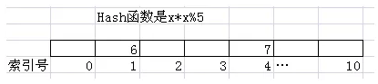
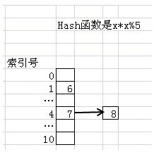
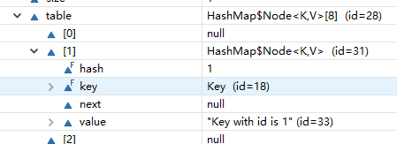
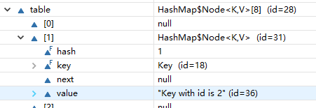
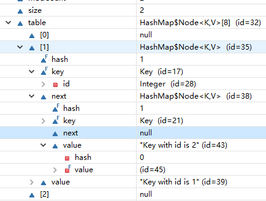

一个简单的面试题：**你在使用`HashMap`时有没有重写`hashCode()`和`equals()`？你是怎么写的？为什么需要覆写上述方法？**

`hashCode()` 和 `equals()` 来自 `java.lang.Object` 类，先来看看其中定义的方法：

~~~java
public native int hashCode();

public boolean equals(Object obj) {
	return (this == obj);
}
~~~

现在软件工程师自定义一个类（比如：`HashMap` 需要存储自定义的类型实例，特别是 `key` 的部分）：

~~~java
/**
 * 自定义 Employee 类，封装雇员数据模型
 * 
 * @author 研发
 *
 */
public class Employee {

	private String name;

	private double salary;

	private LocalDate hireDay;

}
~~~

上述 `Employee` 并没有覆写 `hashCode()` 和 `equals()`，如果默认调用其上述两者方法，得到的结果如下：

~~~java
public static void main(String[] args) {
	System.out.println("Hello hashCode()!");

	Employee employeeFirst = new Employee();
	Employee employeeSecond = new Employee();

	// get hash code of instances
	System.out.println(employeeFirst.hashCode()); // 366712642
	System.out.println(employeeSecond.hashCode()); // 1829164700

	System.out.println(employeeFirst); // com.zebra.lang.bean.Employee@15db9742
	System.out.println(employeeSecond); // com.zebra.lang.bean.Employee@6d06d69c

	// == operator for reference comparison
	if (employeeFirst == employeeSecond) {
		System.out.println("employeeFirst == employeeSecond");
	} else {
		System.out.println("employeeFirst is not equal employeeSecond");
	}
	
	// equals function for reference comparison
	if(employeeFirst.equals(employeeSecond)){
		System.out.println("employeeFirst == employeeSecond");
	} else {
		System.out.println("employeeFirst is not equal employeeSecond");
	}
}
~~~

从 `Object` 类来看：

* `hashCode()`：是一个 `native` 方法，通过 `OpenJDK8` 源代码分析，其结果是通过和当前线程有关的一个随机数 + 三个确定值，运用`Marsaglia's xorshift scheme`随机数算法得到的一个随机数。**和对象内存地址无关**。可以看成**和创建的对象实例一一对应的值**。
* `equals()`：其实现是执行了 `this == obj` 的判断语句。在没有覆写 `hashCode()` 和 `equals()` 的情况下，输出 `employeeFirst` 实例时，打印内容类似：`com.zebra.lang.bean.Employee@15db9742`，最后的十六进制值实际是 `hashCode()` 的结果。**`Object` 中默认的 `equals()` 实际判断的是，两个类型变量引用的是否是同一个对象实例**，该操作是通过引用对象的**内存地址**判断的，**类变量中存放的是堆内存中类实例的地址**。

在没有覆写 `equals()` 的情况下，实际执行的是 `==` 运算符！

**下面从 `HashMap` 的存数规则来看自定义类中 `hashCode()` 和 `equals()` 的用途。**

首先来体会使用 `HashMap` 存对象的高效性：在一个长度为 `N` 的线性表中，存放无序的数字；如果我们要找一个指定的数字，就不得不通过从头到尾依次遍历来查找，这样的平均查找次数是 `N/2`。那如果是使用 `Hash` 表，其平均查找次数接近 1，代价相当小。其关键是在 `Hash` 表中，存放在其中的数据和其存储位置是 `Hash` 函数相关的。

我们假设一个 `Hash` 函数是 `x * x % 5`。当然实际情况里不可能用这么简单的 `Hash` 函数，我们这里纯粹为了说明方便，而 `Hash` 表是一个长度是 11 的线性表。如果我们要把 6 放入其中，那么我们首先会对 6 用 `Hash` 函数计算一下，结果是 1（其值放入到索引号是 1 这个位置）。同样如果我们要放数字 7，经过 `Hash` 函数计算，其结果是4（其值将被放入索引是 4 的这个位置）。

这样查找数据是非常简单方便的，比如：我们要从中找 6 这个元素，我们可以先通过 `Hash` 函数计算 6 的索引位置，然后直接从1号索引里找到它了。不过我们会遇到【`Hash`值冲突】这个问题。比如经过 `Hash` 函数计算后，7 和 8 会有相同的 `Hash` 值，对此 `Java` 的 `HashMap` 对象采用的是”**链地址法**“的解决方案。效果如下图所示。

具体的做法是，为所有 `Hash` 值是 `i` 的对象建立一个**同义词链表**。假设我们在放入 8 的时候，发现 4 号位置已经被占，那么就会**新建一个链表结点**放入8。同样，如果我们要找8，那么发现4号索引里不是8，那会沿着链表依次查找。

虽然我们还是无法彻底避免 `Hash` 值冲突的问题，但是 `Hash` 函数设计合理，仍能保证同义词链表的长度被控制在一个合理的范围里。

那我们现在来解决为什么要覆写 `hashCode()` 和 `equals()` 的问题！

现在软件工程师自定义了 `Key` 类，包含唯一的域 `id`：

~~~java
package com.zebra.lang;

import java.util.HashMap;

public class Test {

	public static void main(String[] args) {
		Key keyFirst = new Key(1);
		Key keySecond = new Key(1);

        // hashCode:1
		System.out.println(keyFirst);
        // hashCode:1
		System.out.println(keySecond);
        
        // false
		if (keyFirst == keySecond) {
			System.out.println("keyFirst's hashCode is equal keySecond!");
		}

		if (keyFirst.equals(keySecond)) {
			System.out.println("keyFirst's hashCode is equal keySecond!");
		}

		HashMap<Key, String> hashMap = new HashMap<>(5);
        // 调用了 Key 的 hashCode()
		hashMap.put(keyFirst, "Key with id is 1");

        // 调用了 Key 的 hashCode() 和 equals()
		System.out.println(hashMap.get(keySecond));
	}

	static class Key {
		private Integer id;

		public Key(int id) {
			this.id = id;
		}

		public Integer getId() {
			return id;
		}

		@Override
		public int hashCode() {
			int hashCode = Integer.hashCode(id);
			System.out.println("hashCode:" + hashCode);
			return hashCode;
		}

		@Override
		public boolean equals(Object obj) {
			if (obj == null || !(obj instanceof Key)) {
				return false;
			} else {
				Key key = (Key) obj;
                // Integer 的 equals() 实际比较的是字面值：value == ((Integer)obj).intValue()
				return this.getId().equals(key.getId());
			}
		}
	}
}
~~~

假设当前情况中，并没有覆写 `hashCode()` 和 `equals()`。上述方法返回结果为 `null`。

逐步去覆写 `hashCode()` 和 `equals()`，带来的影响是：

* `hashCode()`：`keyFirst` 和 `keySecond` 获取的 `hashCode` 是一样的，但 `==` 运算符的结果仍然是 `false`。
* `equals()`：覆写后，让 `id` 相同的对象实例，执行 `equals()` 返回结果为 `true`。

`hashMap.get(keySecond)` 的源代码：

~~~java
/**
 * Implements Map.get and related methods
 *
 * @param hash
 *            hash for key
 * @param key
 *            the key
 * @return the node, or null if none
 */
final Node<K, V> getNode(int hash, Object key) {
	Node<K, V>[] tab;
	Node<K, V> first, e;
	int n;
	K k;
	if ((tab = table) != null && (n = tab.length) > 0
			&& (first = tab[(n - 1) & hash]) != null) {
		if (first.hash == hash && // always check first node
				((k = first.key) == key || (key != null && key.equals(k)))) {
			return first;
		}
		
		if ((e = first.next) != null) {
			if (first instanceof TreeNode){
				return ((TreeNode<K, V>) first).getTreeNode(hash, key);
			}
			
			do {
				if (e.hash == hash && ((k = e.key) == key || (key != null && key.equals(k))))
					return e;
			} while ((e = e.next) != null);
		}
	}
	return null;
}
~~~

能够从 `HashMap` 中取到 `value` 值，需要进行类似 `((k = first.key) == key || (key != null && key.equals(k)))` 或者是 `((k = e.key) == key || (key != null && key.equals(k)))` 的判断（或者应该是存在同义词链表的情况）。**首先判断的是 `hashCode()` 的结果，如果相同，再去判断 `equals()`。当然，如果 `hashCode` 值不相等，则直接返回，不再去判断 `equals()`。**

特别的，`key.equals(k)` 实际就是调用了覆写的 `equals()`。上述判断一旦返回 `true`，就可以从 `HashMap` 中取到 `value`。

下面来看一个思考题：

~~~java
package com.zebra.lang;

import java.util.HashMap;

public class Test {

	public static void main(String[] args) {
		Key keyFirst = new Key(1);
		Key keySecond = new Key(1);

		HashMap<Key, String> hashMap = new HashMap<>(5);
		hashMap.put(keyFirst, "Key with id is 1");
		hashMap.put(keySecond, "Key with id is 2");

        // 执行结果是什么？为什么？
		System.out.println(hashMap.get(keyFirst));
	}

	static class Key {
		private Integer id;

		public Key(int id) {
			this.id = id;
		}

		public Integer getId() {
			return id;
		}

		@Override
		public int hashCode() {
			int hashCode = Integer.hashCode(id);
			return hashCode;
		}

		@Override
		public boolean equals(Object obj) {
			if (obj == null || !(obj instanceof Key)) {
				return false;
			} else {
				Key key = (Key) obj;
				return this.getId().equals(key.getId());
			}
		}
	}
}
~~~

执行结果为：`Key with id is 2`

原因：`Key with id is 2` 是后加入的结点，`key` 的 `hashCode` 是相同的，且 `equals()` 也相同。

比如下述是增加 `Key1` 后的 `HashTable`：

增加 `Key2` 后的 `HashTable`：

其结果相当于是：`Key with id is 2` 替换了 `Key with id is 1`。`Key2` 被认为就是 `Key1`！

如果把 `equals()` 方法注释掉，则结果恢复正常。

那如果把 `equals()` 内容直接返回 `false`，会发生什么情况：

`HashMap` 使用了【同义词链表结构】，也就是：当 `hashCode()` 返回相同结果时，在桶内存放位置相同，但是`key`不是一样的，需要在 `next` 域存放另一个节点内容。