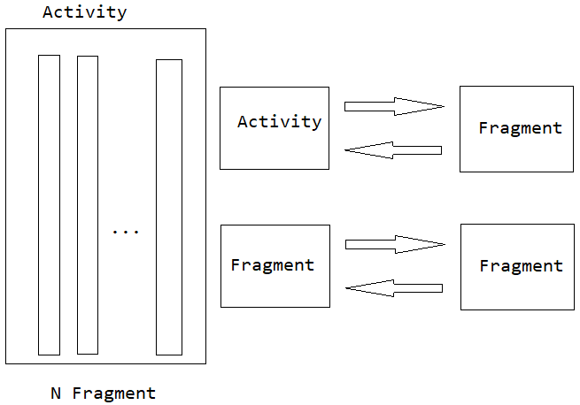

Fragment 和其宿主 Activity 之间的通信方式，当然，Fragment 必须是嵌入到 Activity 【宿主】的！

通信分为**三个不同的方向**：

* **Fragment 调用 Activity 的方法**，或者是 Fragment 向 Activity 发送消息；
	
* 反之，**Activity 调用 Fragment 中的方法**，或者是 Activity 向 Fragment 发送消息；
	
* 最后是：**Fragment 之间的交互和通信**。

从内容上来讲有 2 种：

1. 调用目标类的方法；
2. 向目标类实例传递数据（基本类型数据、对象、Bundle 等）；

简而言之，就是如下图所示的内容：

我们从最简单的 Demo 开始，工程包含有 MainActivity，其中又包含了两个 Fragment——NetworkFragment 和 SqliteFragment。

~~~xml
<?xml version="1.0" encoding="utf-8"?>
<LinearLayout xmlns:android="http://schemas.android.com/apk/res/android"
    xmlns:tools="http://schemas.android.com/tools"
    android:layout_width="match_parent"
    android:layout_height="match_parent"
    android:orientation="vertical"
    tools:context=".MainActivity">

    <fragment
        android:id="@+id/sub_fragment_network"
        android:name="com.zebra.app.fragment.NetworkFragment"
        android:layout_width="match_parent"
        android:layout_height="0dp"
        android:layout_weight="1" />

    <fragment
        android:id="@+id/sub_fragment_sqlite"
        android:name="com.zebra.app.fragment.SqliteFragment"
        android:layout_width="match_parent"
        android:layout_height="0dp"
        android:layout_weight="1" />

</LinearLayout>
~~~

同时NetworkFragment 和 SqliteFragment 各自创建了类，继承自 android.app.Fragment。

~~~java
package com.zebra.app.fragment;

import android.app.Fragment;
import android.os.Bundle;
import android.support.annotation.Nullable;
import android.view.LayoutInflater;
import android.view.View;
import android.view.ViewGroup;

import com.zebra.app.R;

public class NetworkFragment extends Fragment {

    @Override
    public void onCreate(@Nullable Bundle savedInstanceState) {
        super.onCreate(savedInstanceState);
    }

    @Nullable
    @Override
    public View onCreateView(LayoutInflater inflater, @Nullable ViewGroup container,
                             Bundle savedInstanceState) {
        return inflater.inflate(R.layout.fragment_network, container, false);
    }

    @Override
    public void onViewCreated(View view, @Nullable Bundle savedInstanceState) {
        super.onViewCreated(view, savedInstanceState);

    }
}

~~~

SqliteFragment 和 NetworkFragment 相类似。在创建上述简单的工程程序时，遇到了 2 个问题：

1. `Binary XML file line #0: Must specify unique android:id, android:tag, or have a parent with an id for com.zebra.app.fragment.NetworkFragment` 解决办法：在 activity_main.xml 中为每个 fragment 标签定义唯一的 id；
2. `Caused by: java.lang.IllegalStateException: Fragment com.zebra.app.fragment.NetworkFragment did not create a view.` Fragmeng 无法创建 View，解决办法：在 NetworkFragment 的 onCreateView() 中，为其返回创建的 View 实例。

下面从主题触发，讲述 Activity 和 Fragment 之间的通信方式。

# 1 从 Fragment 到 Activity

**Fragment 调用 Activity 的方法**，或者是 Fragment 向 Activity 发送消息；

1. 在 Fragment 中可以通过 getActivity() 获取到其宿主 Activity，通过宿主 Activity 实例，调用其中的 public 方法；
2. 在 Activity 中定义 Handler，Fragment 可获取该 Handler 实例，并通过 Handler 发送消息，并在 Activity 中获取时进行处理；
3. 借助基本组件：Broadcast 机制。在 Activity 中注册广播接收者，Fragment 负责发送广播；
4. 接口回调机制：在 Fragment 中定义接口，对应的宿主 Activity 实现该接口。

在 Fragment 中获取宿主 Activity 的方式很简单：

~~~java
package com.zebra.app.fragment;

import android.app.Activity;
import android.app.Fragment;
import android.os.Bundle;
import android.support.annotation.Nullable;
import android.view.LayoutInflater;
import android.view.View;
import android.view.ViewGroup;

import com.zebra.app.LogUtil;
import com.zebra.app.MainActivity;
import com.zebra.app.R;

public class NetworkFragment extends Fragment {

    private static final String TAG = "NetworkFragment";

    @Nullable
    @Override
    public View onCreateView(LayoutInflater inflater, @Nullable ViewGroup container,
                             Bundle savedInstanceState) {
        return inflater.inflate(R.layout.fragment_network, container, false);
    }
    

    @Override
    public void onResume() {
        super.onResume();

        // 获取宿主 Activity
        Activity activity = NetworkFragment.this.getActivity();
        if (activity instanceof MainActivity) {
            LogUtil.d(TAG, "NetworkFragment 获取宿主 Activity ___ " + R.layout.fragment_network);

            // 转化为指定的 Activity，相当于获取了对象，通过该对象调用其中的 public 方法
            MainActivity mainActivity = (MainActivity) activity;
            mainActivity.funcInActivity(R.layout.fragment_network);
        }
    }
}

~~~

代码注释已经写得很明确了，逻辑是很简单的。

而使用 Handler 则比较曲折：

~~~java
package com.zebra.app;

import android.os.Bundle;
import android.os.Handler;
import android.os.Message;
import android.support.v7.app.AppCompatActivity;

import java.lang.ref.WeakReference;

public class MainActivity extends AppCompatActivity {

    private static final String TAG = "MainActivity";

    private MainHandler mainHandler = new MainHandler(MainActivity.this);

    @Override
    protected void onCreate(Bundle savedInstanceState) {
        super.onCreate(savedInstanceState);
        setContentView(R.layout.activity_main);
    }

    public Handler getHandler() {
        return mainHandler;
    }

    public void funcInActivity(int fragmentId) {
        LogUtil.d(TAG, "fragmentId:" + fragmentId);
    }

    class MainHandler extends android.os.Handler {
		// 使用弱引用的方式创建了 MainHandler 类
        private WeakReference<MainActivity> mainActivityWeakReference;

        public MainHandler(MainActivity mainActivity) {
            this.mainActivityWeakReference = new WeakReference<>(mainActivity);
        }

        @Override
        public void handleMessage(Message msg) {
            super.handleMessage(msg);

            int what = msg.what;
            LogUtil.d(TAG, "MainHandler: msg.what " + what);
        }
    }
}

~~~

在 MainActivity 中创建了 Handler 实例，并开放了获取 Handler 实例的接口 getHandler()。Fragment 可以获取到 Activity 就可以获取其中的 Handler 实例：

~~~java
package com.zebra.app.fragment;

import android.app.Activity;
import android.app.Fragment;
import android.os.Bundle;
import android.os.Handler;
import android.support.annotation.Nullable;
import android.view.LayoutInflater;
import android.view.View;
import android.view.ViewGroup;

import com.zebra.app.LogUtil;
import com.zebra.app.MainActivity;
import com.zebra.app.R;

public class NetworkFragment extends Fragment {

    private static final String TAG = "NetworkFragment";

    private Handler mainHandler;

    @Nullable
    @Override
    public View onCreateView(LayoutInflater inflater, @Nullable ViewGroup container,
                             Bundle savedInstanceState) {
        return inflater.inflate(R.layout.fragment_network, container, false);
    }

    @Override
    public void onAttach(Activity activity) {
        super.onAttach(activity);

        // 获取到 Handler 实例
        if (activity instanceof MainActivity) {
            mainHandler = ((MainActivity) activity).getHandler();
        }
    }

    @Override
    public void onResume() {
        super.onResume();

        Activity activity = NetworkFragment.this.getActivity();
        if (activity instanceof MainActivity) {
            LogUtil.d(TAG, "NetworkFragment 获取宿主 Activity ___ " + R.layout.fragment_network);

            MainActivity mainActivity = (MainActivity) activity;
            mainActivity.funcInActivity(R.layout.fragment_network);
        }

        mainHandler.sendMessage(mainHandler.obtainMessage(R.layout.fragment_network));
    }
}

~~~

NetworkFragment 通过 MainHandler 给 Activity 发送消息。

上述两种方式都存在**弊端**：

1. Fragment 对具体的 Activity 存在耦合，不利于 Fragment 的复用，同时也不利于 Activity 的改动；
2. 方式一，可以获取到 Activity 执行逻辑的返回值，但是方法二仅仅相当于发送了消息，没有任何反馈；

借助于 Android 组件：广播机制，实现 Fragment 向宿主 Activity 发送消息，并以此执行对应的业务逻辑。这种就不做演示程序了，弊端在于：代码耦合性低，但是比一般的方法调用更耗费系统资源。

接口回调机制：在 Fragment 中定义接口，对应的宿主 Activity 实现该接口。这种方式代码耦合性更高，仅仅知道有这种方式即可！

# 2 从 Activity 到 Fragment

在 Activity 中可以通过 FragmentManager 获取到 Fragment 实例，并依据 Fragment 的不同，调用其 public 方法，以此达到通信目的：

~~~java
@Override
protected void onResume() {
	super.onResume();

	NetworkFragment networkFragment =
			(NetworkFragment) MainActivity.this.getFragmentManager().findFragmentById(R.id.sub_fragment_network);
	if(networkFragment != null){
        // 调用 NetworkFragment 中的 public 方法
		networkFragment.fundInNetworkFragment();
	}
}
~~~

还有一种让 Activity 向 Fragment 发送消息：

~~~java
NetworkFragment discoverFragment = new NetworkFragment();
Bundle bundle = new Bundle();
bundle.putString("fragment_content", content);
networkFragment.setArguments(bundle);
~~~

上述这种方式一般用在动态加载 Fragment 中。

在 NetworkFragment 中接收消息：

~~~java
@Nullable
@Override
public View onCreateView(LayoutInflater inflater, @Nullable ViewGroup container,
						 Bundle savedInstanceState) {
	View view = inflater.inflate(R.layout.fragment_network, container, false);

	Bundle bundle = getArguments();
	if(bundle != null){
		String content = bundle.getString("fragment_content");
	}

	return view;
}
~~~

# 3 从 Fragment 到 Fragment

宿主 Activity 中存在多个 Fragment，现在的问题是如何让这些 Fragment 间通信？

单个 Fragment 可以通过宿主 Activity 拿到其他 Fragment 实例，然后调用其中定义的 public 方法即可。