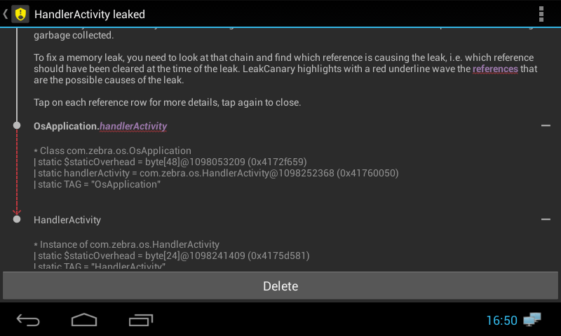
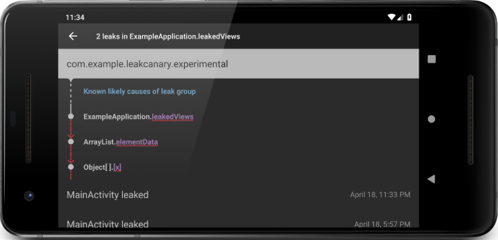
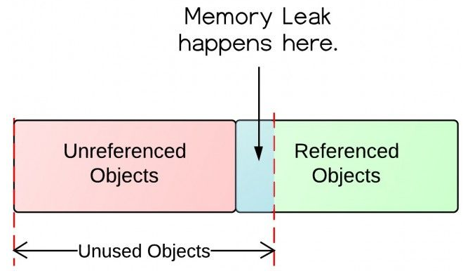
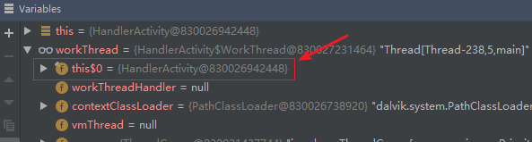
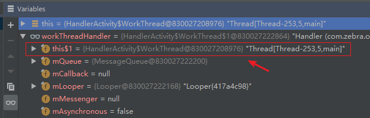
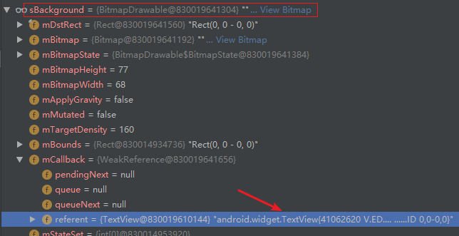
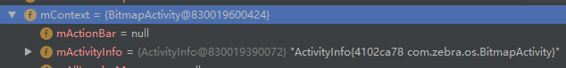
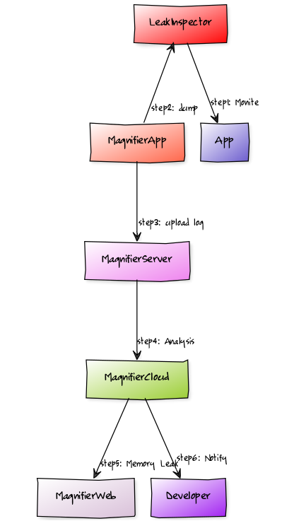

> *“A small leak will sink a great ship.”* - Benjamin Franklin
>
> 千里之堤，毁于蚁穴。
>
> 全文相关资料库：
>
> 1. [GitHub for LeakCanary](https://square.github.io/leakcanary/fundamentals/)

# 1 Memory Leak

在 Java 虚拟机中（Java 运行环境 JVM），进程在运行对象不再使用，但仍然持有该对象的引用，这就是**内存泄漏**。**内存泄漏是一种程序错误，是程序设计时的问题导致的**。内存泄漏的结果，导致该对象所占用的内存不会重新被分配，最终引发 `OutOfMemoryError` 异常。

比如很简单演示一个内存泄漏的示例程序：一般情况下 Activity 在执行了 onDestory() 之后，其对象实例将不再使用。如果在静态字段域中定义了该 Activity 对象实例的引用时，会让 GC 无法释放 Activity 实例所占用的内存。这种情况会导致内存泄漏！

~~~java
package com.zebra.os;

import android.app.Activity;
import android.app.Application;

import com.squareup.leakcanary.LeakCanary;

public class OsApplication extends Application {

    private static final String TAG = "OsApplication";
	// 静态字段域，引用了 HandlerActivity 实例
    public static Activity handlerActivity;

    @Override
    public void onCreate() {
        super.onCreate();

        boolean isInAnalyzerProcess = LeakCanary.isInAnalyzerProcess(this);
        LogUtil.d(TAG, "isInAnalyzerProcess:" + isInAnalyzerProcess);
        if (isInAnalyzerProcess) {
            // This process is dedicated to LeakCanary for heap analysis.
            // You should not init your app in this process.
            return;
        }

        LeakCanary.install(this);
        // Normal app init code...
    }
}

~~~

与之对应的 HandlerActivity 定义如下：

~~~java
public class HandlerActivity extends AppCompatActivity implements View.OnClickListener {

	...

    @Override
    protected void onCreate(Bundle savedInstanceState) {
        super.onCreate(savedInstanceState);
        setContentView(R.layout.activity_main);

        this.findViewById(R.id.btn_send_runnable).setOnClickListener(this);
        this.findViewById(R.id.btn_send_message).setOnClickListener(this);
		// 为 OsApplication 中的静态字段赋值
        OsApplication.handlerActivity = this;
    }
    ...
 }
~~~

`OsApplication.handlerActivity = this;` 该对象引用了 Activity 实例，当 onDestory 执行结束后，GC 程序会试图去清理内存，但是发现该对象还存在引用，导致了 GC 程序无法清理这部分内存！【`OsApplication.handlerActivity` 生命周期**长**，但是 `HandlerActivity` 生命周期**短**】

LeakCanary 检测到内存泄漏后，给出的提示信息：

~~~
In com.zebra.androidapidemo:1.0:1.
* com.zebra.os.HandlerActivity has leaked:
* static OsApplication.!(handlerActivity)!
* ↳ HandlerActivity
* Reference Key: f783e7e6-a8a4-4663-b99e-1e28ffffbea9
* Device: unknown softwinners SoftwinerEvb wing_mc_v80
* Android Version: 4.2.2 API: 17 LeakCanary: 1.6.3 31007b4
* Durations: watch=5031ms, gc=252ms, heap dump=884ms, analysis=9943ms
* Details:
* Class com.zebra.os.OsApplication
|   static $staticOverhead = byte[48]@1098053209 (0x4172f659)
|   static handlerActivity = com.zebra.os.HandlerActivity@1098252368 (0x41760050)
|   static TAG = "OsApplication"
* Instance of com.zebra.os.HandlerActivity
|   static $staticOverhead = byte[24]@1098241409 (0x4175d581)
|   static TAG = "HandlerActivity"
|   workThread = com.zebra.os.HandlerActivity$WorkThread@1098540968 (0x417a67a8)
|   mainCallback = com.zebra.os.HandlerActivity$1@1098268584 (0x41763fa8)
|   mainHandler = com.zebra.os.WeakReferenceHandler@1098269240 (0x41764238)
|   MSG_WHAT = 255
|   mDelegate = android.support.v7.app.AppCompatDelegateImplV14@1098280120 (0x41766cb8)
|   mResources = null
|   mThemeId = 2131492869
|   mPendingFragmentActivityResults = android.support.v4.util.SparseArrayCompat@1098338760 (0x417751c8)
|   mFragments = android.support.v4.app.FragmentController@1098267664 (0x41763c10)
|   mHandler = android.support.v4.app.FragmentActivity$1@1098260632 (0x41762098)
|   mNextCandidateRequestIndex = 0
|   mCreated = true
|   mReallyStopped = true
|   mRequestedPermissionsFromFragment = false
|   mResumed = false
|   mRetaining = false
|   mStopped = true
|   mStartedActivityFromFragment = false
|   mStartedIntentSenderFromFragment = false
|   mExtraDataMap = android.support.v4.util.SimpleArrayMap@1098253992 (0x417606a8)
|   mLifecycleRegistry = android.arch.lifecycle.LifecycleRegistry@1098256320 (0x41760fc0)
|   mActionBar = null
|   mActivityInfo = android.content.pm.ActivityInfo@1098032464 (0x4172a550)
|   mAllLoaderManagers = java.util.HashMap@1098537984 (0x417a5c00)
|   mApplication = com.zebra.os.OsApplication@1098053608 (0x4172f7e8)
|   mWindowManager = android.view.WindowManagerImpl@1098272208 (0x41764dd0)
|   mWindow = com.android.internal.policy.impl.PhoneWindow@1098270096 (0x41764590)
|   mUiThread = java.lang.Thread@1092753824 (0x412219a0)
|   mComponent = android.content.ComponentName@1098031968 (0x4172a360)
|   mToken = android.os.BinderProxy@1098032368 (0x4172a4f0)
|   mContainer = android.app.Activity$1@1098252808 (0x41760208)
|   mCurrentConfig = android.content.res.Configuration@1098269960 (0x41764508)
|   mDecor = null
|   mTitle = "AndroidApiDemo"
|   mDefaultKeySsb = null
|   mSearchManager = null
|   mEmbeddedID = null
|   mResultData = null
|   mParent = null
|   mFragments = android.app.FragmentManagerImpl@1098252688 (0x41760190)
|   mHandler = android.os.Handler@1098252976 (0x417602b0)
|   mMenuInflater = null
|   mInstanceTracker = android.os.StrictMode$InstanceTracker@1098252848 (0x41760230)
|   mInstrumentation = android.app.Instrumentation@1098048072 (0x4172e248)
|   mIntent = android.content.Intent@1098031704 (0x4172a258)
|   mLastNonConfigurationInstances = null
|   mLoaderManager = null
|   mManagedDialogs = null
|   mMainThread = android.app.ActivityThread@1098025336 (0x41728978)
|   mManagedCursors = java.util.ArrayList@1098252824 (0x41760218)
|   mLoadersStarted = false
|   mIdent = 1098147072
|   mFinished = true
|   mResultCode = 0
|   mEnableDefaultActionBarUp = false
|   mResumed = false
|   mDestroyed = true
|   mStartedActivity = false
|   mStopped = true
|   mTemporaryPause = false
|   mDefaultKeyMode = 0
|   mTitleColor = 0
|   mTitleReady = true
|   mConfigChangeFlags = 0
|   mCheckedForLoaderManager = true
|   mVisibleFromClient = true
|   mVisibleFromServer = true
|   mChangingConfigurations = false
|   mWindowAdded = true
|   mCalled = true
|   mBase = android.app.ContextImpl@1098269312 (0x41764280)
|   mInflater = com.android.internal.policy.impl.PhoneLayoutInflater@1098271192 (0x417649d8)
|   mOverrideConfiguration = null
|   mResources = android.content.res.Resources@1098042984 (0x4172ce68)
|   mTheme = android.content.res.Resources$Theme@1098274240 (0x417655c0)
|   mThemeResource = 2131492869
|   mBase = android.app.ContextImpl@1098269312 (0x41764280)
* Excluded Refs:
| Field: android.widget.Editor$EasyEditSpanController.this$0
| Field: android.widget.Editor$SpanController.this$0
| Field: android.os.Message.obj
| Field: android.os.Message.next
| Field: android.os.Message.target
| Field: android.view.inputmethod.InputMethodManager.mNextServedView
| Field: android.view.inputmethod.InputMethodManager.mServedView
| Field: android.view.inputmethod.InputMethodManager.mServedInputConnection
| Field: android.view.inputmethod.InputMethodManager.mCurRootView
| Field: android.animation.LayoutTransition$1.val$parent
| Field: android.view.textservice.SpellCheckerSession$1.this$0
| Field: android.support.v7.internal.widget.ActivityChooserModel.mActivityChoserModelPolicy
| Field: android.widget.ActivityChooserModel.mActivityChoserModelPolicy
| Field: android.speech.SpeechRecognizer$InternalListener.this$0
| Field: android.accounts.AccountManager$AmsTask$Response.this$1
| Field: android.media.MediaScannerConnection.mContext
| Field: android.appwidget.AppWidgetHost$Callbacks.this$0
| Field: android.media.AudioManager$1.this$0
| Field: android.widget.Editor$Blink.this$0
| Field: android.net.ConnectivityManager.sInstance
| Field: android.view.Choreographer$FrameDisplayEventReceiver.mMessageQueue (always)
| Static field: android.text.TextLine.sCached
| Thread:FinalizerWatchdogDaemon (always)
| Thread:main (always)
| Thread:LeakCanary-Heap-Dump (always)
| Class:java.lang.ref.WeakReference (always)
| Class:java.lang.ref.SoftReference (always)
| Class:java.lang.ref.PhantomReference (always)
| Class:java.lang.ref.Finalizer (always)
| Class:java.lang.ref.FinalizerReference (always)
~~~

从上述信息可以直接定位出 HandlerMainActivity 对象的引用关系：



**那一般什么情况下会出现内存泄漏？**

**绝大部分内存泄漏，是和对象生命周期相关的 bug 引起的**。下面列举一些 Android 实践中的**例子**：

1. 在某个类中将 Activity 的上下文对象 Context 作为字段域存储，该 Context 对象由于配置的更改而 Activity 重建后仍然存在；
2. 注册监听器、广播接收者或者是 RxJava 中订阅时，引用了具有生命周期的实例对象，而在该对象生命周期结束时遗忘了反注册过程；
3. 在静态字段域中存储了 View 对象实例，当 View 分离时，没有清除该字段；

综合起来，就是**生命周期长的实例，持有了生命周期短的对象的引用，导致生命周期短的实例无法被 GC 程序清理内存**。

# 2 LeakCanary

LeakCanary 是 Android 平台下检测内存泄漏的库。



在 Android 项目中集成 LeakCanary 的方式：

~~~xml
dependencies {
    implementation fileTree(dir: 'libs', include: ['*.jar'])
    implementation 'com.android.support:appcompat-v7:26.1.0'
    implementation 'com.android.support.constraint:constraint-layout:1.1.3'
    testImplementation 'junit:junit:4.12'
    androidTestImplementation 'com.android.support.test:runner:1.0.2'
    androidTestImplementation 'com.android.support.test.espresso:espresso-core:3.0.2'

    // debugImplementation because LeakCanary should only run in debug builds.
    // debugImplementation 'com.squareup.leakcanary:leakcanary-android:2.0-beta-2'
    debugImplementation 'com.squareup.leakcanary:leakcanary-android:1.6.3'
    releaseImplementation 'com.squareup.leakcanary:leakcanary-android-no-op:1.6.3'
    // Optional, if you use support library fragments:
    debugImplementation 'com.squareup.leakcanary:leakcanary-support-fragment:1.6.3'
}
~~~

需要指出的是 `debugImplementation 'com.squareup.leakcanary:leakcanary-android:2.0-beta-2'` 无法编译通过，而使用 `debugImplementation 'com.squareup.leakcanary:leakcanary-android:1.6.3'` 确实可以编译通过的。

在项目的调试过程【Debug 模式】中，如果内存泄漏被 LeakCanary 检测到，会弹出一个 Notification 框提示。

## 2.1 原理

LeakCanary 是怎么工作的？

LeakCanary 的基础是 Android 中的 ObjectWatcher 机制。`ObjectWatcher` 机制挂钩到 `Android` 生命周期，以自动检测 Activity 和 Fragment 何时销毁，并适时启动 GC 程序。这些即将被销毁的实例，传给 ObjectWatcher 并持有这些实例的弱引用。我们可以监测任何不再使用的实例，比如：被分离的 View 实例等。

**如果运行了 GC 清理程序，对象所占用的内存空间在 5 秒后还未清空，则被 ObjectWatcher 持有的这些弱引用视为保留的，也就是潜在地发生了内存泄漏。**

当被持有的对象超过了阈值，LeakCanary会以 `.hprof` 格式导出 Java heap 数据到文件系统中。在 App 进程可见的情况下，该阈值为 5；不可见时，该值为1。

LeakCanary 使用 Shark 组件解析 `.hprof` 文件，并从中找到对象的引用链（引用关系，让 GC 程序无法执行内存清理）：**泄漏的跟踪信息**。`Leak trace` 是**最短强引用路径**的别名。 一旦确定了泄漏跟踪，LeakCanary 就会利用其内置的 Android 框架知识来推断泄漏跟踪中的哪些实例正在泄漏。

## 2.2 如何处理内存泄漏

如何处理内存泄漏？这一节内容是描述通过 LeakCanary 组件探测到了内存泄漏，并找到内存泄漏的位置。


在上述 LeakCanary 的输出日志中，每个结点相当于是：一个 Java 实例，要么是类，或者是对象数组或者是对象实例。

从 `OsApplication.handlerActivity` 指向 `HandlerActivity` 的箭头表明：前者引用后者的实例。对于 UI 实例，这种箭头的颜色是紫色的。

在**泄露跟踪信息链条**的顶端是 `GC root`，`GC root` 是**一种特殊的对象实例**，有以下 4 种实例需要引起注意：

1. 本地类实例，从属于线程栈内存；
2. 处于活动状态的线程对象；
3. 从未加载到 Android 中的类对象；
4. 被 Native 代码控制的 Native 引用；

在泄露跟踪信息链条的最底部，是当前泄露的对象实例。

~~~
In com.zebra.androidapidemo:1.0:1.
* com.zebra.os.HandlerActivity has leaked:
* static OsApplication.!(handlerActivity)!
* ↳ HandlerActivity
* Reference Key: f783e7e6-a8a4-4663-b99e-1e28ffffbea9
* Device: unknown softwinners SoftwinerEvb wing_mc_v80
* Android Version: 4.2.2 API: 17 LeakCanary: 1.6.3 31007b4
* Durations: watch=5031ms, gc=252ms, heap dump=884ms, analysis=9943ms
* Details:
* Class com.zebra.os.OsApplication
|   static $staticOverhead = byte[48]@1098053209 (0x4172f659)
|   static handlerActivity = com.zebra.os.HandlerActivity@1098252368 (0x41760050)
|   static TAG = "OsApplication"
* Instance of com.zebra.os.HandlerActivity
|   static $staticOverhead = byte[24]@1098241409 (0x4175d581)
|   static TAG = "HandlerActivity"
~~~

上述信息指明了 OsApplication 中的 handlerActivity 导致了内存泄露。

# 3 内存泄露实例分析

**持有对象的强引用，垃圾回收器是无法在内存中回收这个对象的，这是内存泄漏的原因**。比如：如果 onDestory() 执行完，在堆栈中仍存在持有该 Activity 的强引用，垃圾回收器就无法把它标记成已回收的内存，而我们本来目的就是要回收它！

**内存泄漏是造成应用程序 OOM 的原因之一**。由于 Android 系统为每个应用程序分配的内存有限，当一个应用程序中产生的内存泄漏过多时，会导致应用程序所需要的内存超过这个系统分配的内存限额，这就造成了内存溢出而导致应用 Crash。

我们先来看看 Java 虚拟机的内存分配情况：

1. **静态储存区**：编译时就分配好，在程序整个运行期间都存在。它主要存放静态数据和常量；
2. **栈区**：当方法执行时，会在栈区内存中创建方法体内部的局部变量，**方法结束后自动释放内存**；
3. **堆区**：通常存放 new 出来的对象。**由 Java 垃圾回收器回收**。

用一个形象的图来描述内存泄漏产生的问题：




另外还引出了一个主题：为什么好做内存优化？

Android 每一个应用都是运行的独立的 `ART`，根据不同的手机分配的可用内存可能只有（32M、64M等），所谓的4GB、6GB运行内存其实对于我们的应用不是可以任意索取。优秀的算法与效率低下的算法之间的运行效率要远远超过计算机硬件的的发展，虽然手机单核、双核到4核、8核的发展，但性能优化任然不可忽略。现在一般的用户都不会重启手机，可能一个月都不会重启。像微信这样的 APP，每天都在使用。如果一旦发生内存泄漏，那么可能一点一点的累积，程序就会出现 OOM。为了我们的应用的**健壮性**、有**良好的用户体验**。性能优化技术，需要我们用心去研究和应用。

~~~
java.lang.OutOfMemoryError: thread creation failed
        at java.lang.VMThread.create(Native Method)
        at java.lang.Thread.start(Thread.java:1050)
        at java.util.Timer$TimerImpl.<init>(Timer.java:192)
        at java.util.Timer.<init>(Timer.java:367)
        at java.util.Timer.<init>(Timer.java:387)
        at java.util.Timer.<init>(Timer.java:394)
        at com.szIdeaComm.Viper.Cdi.Gpio.Instance.SingleGpioInstance.gpioChange(SingleGpioInstance.java:52)
        at com.szIdeaComm.Viper.Cdi.Gpio.GpioManager$GpioGetQueueThread.run(GpioManager.java:132)
~~~

上述就是一个简单的 `OOM` 实例，在创建子线程时出现了 `OOM`！

## 3.1 静态变量

实例1：Activity 中定义静态变量，该静态变量引用了自身 Activity 实例对象。

```java
public class HandlerActivity extends AppCompatActivity implements View.OnClickListener {

    private static final String TAG = HandlerActivity.class.getSimpleName();

    private final int MSG_WHAT = 0xFF;

    private WorkThread workThread;

    // 定义静态变量
    private static Activity handlerActivity;

    private Handler.Callback mainCallback = new Handler.Callback() {

        @Override
        public boolean handleMessage(Message msg) {
            if (MSG_WHAT == msg.what) {
                LogUtil.trace("主线程获取 Message");
            }

            return true;
        }
    };

    private Handler mainHandler = new WeakReferenceHandler(mainCallback);

    @Override
    protected void onCreate(Bundle savedInstanceState) {
        super.onCreate(savedInstanceState);
        LogUtil.d(TAG, "HandlerActivity 创建");

        setContentView(R.layout.activity_main);

        this.findViewById(R.id.btn_send_runnable).setOnClickListener(this);
        this.findViewById(R.id.btn_send_message).setOnClickListener(this);

        // 静态变量引用的是自身 Activity 实例
        handlerActivity = this;
    }
    ...
```

LeakCanary 内存泄漏信息：

```
In com.zebra.androidapidemo:1.0:1.
* com.zebra.os.HandlerActivity has leaked:
* static HandlerActivity.!(handlerActivity)!
* ↳ HandlerActivity
* Reference Key: 6d5b33b7-6404-49d9-a7a7-bd45911e5255
* Device: unknown softwinners SoftwinerEvb wing_mc_v80
* Android Version: 4.2.2 API: 17 LeakCanary: 1.6.3 31007b4
* Durations: watch=5027ms, gc=214ms, heap dump=696ms, analysis=8614ms
* Details:
* Class com.zebra.os.HandlerActivity
|   static $staticOverhead = byte[48]@1098231617 (0x4175af41)
|   static handlerActivity = com.zebra.os.HandlerActivity@1098242816 (0x4175db00)
|   static TAG = "HandlerActivity"
* Instance of com.zebra.os.HandlerActivity
|   static $staticOverhead = byte[48]@1098231617 (0x4175af41)
|   static handlerActivity = com.zebra.os.HandlerActivity@1098242816 (0x4175db00)
|   static TAG = "HandlerActivity"
|   workThread = com.zebra.os.HandlerActivity$WorkThread@1098531664 (0x417a4350)
|   mainCallback = com.zebra.os.HandlerActivity$1@1098259000 (0x41761a38)
|   mainHandler = com.zebra.os.WeakReferenceHandler@1098259656 (0x41761cc8)
```

`static HandlerActivity.!(handlerActivity)!` 导致了内存泄漏。

此处为什么会出现内存泄漏？涉及到了 static 关键字的性质。**static 关键字是在类加载到虚拟机后，就一直存在！**HandlerActivity 中的 handlerActivity 变量在 onCreate() 中赋予了 HandlerActivity 实例，也就是 handlerActivity 引用指向了 HandlerActivity 实例。并且该引用一直存在于 Java 虚拟机中，因为是静态的。

解决办法：在 HandlerActivity 执行了 onDestory() 后，将  handlerActivity 变量置位 null，释放引用。

> 关于 static 关键词的分析：
>
> 在 《Java 编程思想》 中有这么一句话：【static 方法就是没有 this 的方法。在 static 方法内部不能调用非静态方法，反过来是可以的。而且可以在没有创建任何对象的前提下，仅仅通过类本身来调用 static 方法。这实际上正是 static 方法的主要用途。】
>
> 很显然，被 static 关键字修饰的方法或变量不需要依赖于对象来进行访问，只要类被加载到虚拟机，就可以通过类名去访问。static 可以用来修饰类的成员方法、类的成员变量，另外可以编写 static 代码块来优化程序性能。
>
> 被 static 修饰的方法，被称为是静态方法。如果说想在不创建对象的情况下调用某个方法，就可以将这个方法设置为static。我们最常见的static方法就是main方法，至于为什么main方法必须是static的，现在就很清楚了。因为程序在执行main方法的时候没有创建任何对象，因此只有通过类名来访问。
>
> 静态方法中，涉及到的所有变量必须都是静态的，涉及到的所有方法也必须是静态的。因为非静态成员方法/变量都是必须依赖具体的对象才能够被调用。
>
> 被 static 修饰的变量，被称为静态变量。静态变量和非静态变量的区别：静态变量被所有的对象所共享，**在内存中只有一个副本**，它当且仅当在类初次加载时会被初始化。而非静态变量是对象所拥有的，在创建对象的时候被初始化，存在多个副本，各个对象拥有的副本互不影响。static 成员变量的初始化顺序按照定义的顺序进行初始化。

再比如：

```java
 private static ScrollHelper mInstance;    
 private ScrollHelper() {
 }    
 public static ScrollHelper getInstance() {        
     if (mInstance == null) {           
        synchronized (ScrollHelper.class) {                
             if (mInstance == null) {
                 mInstance = new ScrollHelper();
             }
         }
     }        

     return mInstance;
 }    
 /**
  * 被点击的view
  */
 private View mScrolledView = null;    
 public void setScrolledView(View scrolledView) {
     // 被点击的 View 实例作为参数传入，并赋值给强引用变量 mScrolledView
     mScrolledView = scrolledView;
 }
```

被点击的 View 实例作为参数传入，并赋值给强引用变量 mScrolledView，相当于 ScrollHelper 类的静态单例实例持有了该 View，导致 View 占用的内存空间一直无法释放，造成了内存泄漏。

```java
 private static ScrollHelper mInstance;    
 private ScrollHelper() {
 }    
 public static ScrollHelper getInstance() {        
     if (mInstance == null) {            
         synchronized (ScrollHelper.class) {                
             if (mInstance == null) {
                 mInstance = new ScrollHelper();
             }
         }
     }        

     return mInstance;
 }    
 /**
  * 被点击的view
  */
 private WeakReference<View> mScrolledViewWeakRef = null;    
 public void setScrolledView(View scrolledView) {
     mScrolledViewWeakRef = new WeakReference<View>(scrolledView);
 }
```

static 声明的变量很容易造成内存泄漏。

## 3.2 内部类

实例2：**非静态内部类**和**匿名内部类**都会潜在地引用其所属外部类，也就是持有外部类对象。静态内部类不会持有外部类对象。

```java
public class HandlerActivity extends AppCompatActivity implements View.OnClickListener {

    private static final String TAG = HandlerActivity.class.getSimpleName();
    
    ...
        
    @Override
    protected void onResume() {
        super.onResume();

        workThread = new WorkThread();
        workThread.start();
    }
    
    ...
        
    /**
     * @Description: 创建工作线程，并在其中创建与该线程对一个的 Handler 实体
     * @Author: yaya
     * @CreateDate: 2019/2/24 16:00
     */
    class WorkThread extends Thread {

        private Handler workThreadHandler;

        @Override
        public void run() {
            super.run();

            Looper.prepare();

            workThreadHandler = new Handler() {

                @Override
                public void handleMessage(Message msg) {
                    super.handleMessage(msg);
                    LogUtil.trace("子线程的 Handler 被触发！");
                }
            };

            Looper.loop();
        }

        public Handler getWorkThreadHandler() {
            return workThreadHandler;
        }
    }
}
```

在 HandlerActivity 中定义了非静态内部类 WorkThread，用于子线程的消息循环和处理。一旦创建了 workThread 实例，会默认持有外部类 HandlerActivity 的对象实例。如下图 `this$0` 所示：



另外 WorkThread 的定义中使用到了 Handler 的非静态内部类，同样也会持有 WorkThread 的实例对象：



那如果在 WorkThread 子线程中并没有耗时操作，以及 workThreadHandler 没有待处理的 Message（MessageQueue 中没有阻塞的消息队列），就不会有内存泄漏的可能。那下面模拟在 WorkThread 中执行耗时操作：

```java
/**
 * @Description: 创建工作线程，并在其中创建与该线程对一个的 Handler 实体
 * @Author: yaya
 * @CreateDate: 2019/2/24 16:00
 */
class WorkThread extends Thread {

	private Handler workThreadHandler;

	@Override
	public void run() {
		super.run();

		Looper.prepare();

		workThreadHandler = new Handler() {

			@Override
			public void handleMessage(Message msg) {
				super.handleMessage(msg);
				LogUtil.trace("子线程的 Handler 被触发！");
			}
		};

		Looper.loop();

		try {
            // 模拟子线程执行耗时操作
			Thread.sleep(10000);
		} catch (InterruptedException e) {
			e.printStackTrace();
		}
	}

	public Handler getWorkThreadHandler() {
		return workThreadHandler;
	}
}
```

模拟在工作线程中执行耗时操作，还没等到 WorkThread 线程执行完，外部 HandlerThread 执行了 onDestory() 等待 GC 执行内存清理。但这个时候 workThread 持有了外部类 HandlerActivity 的对象实例，导致无法执行内存释放。

```
In com.zebra.androidapidemo:1.0:1.
* com.zebra.os.HandlerActivity has leaked:
* thread HandlerActivity$WorkThread.!(<Java Local>)! (named 'Thread-259')
* ↳ thread HandlerActivity$WorkThread.!(this$0)! (named 'Thread-259')
* ↳ HandlerActivity
* Reference Key: e40863eb-6832-45ac-a220-73a58fbad2e1
* Device: unknown softwinners SoftwinerEvb wing_mc_v80
* Android Version: 4.2.2 API: 17 LeakCanary: 1.6.3 31007b4
* Durations: watch=5026ms, gc=248ms, heap dump=776ms, analysis=8281ms
* Details:
* Instance of com.zebra.os.HandlerActivity$WorkThread
|   this$0 = com.zebra.os.HandlerActivity@1098238136 (0x4175c8b8)
|   workThreadHandler = com.zebra.os.HandlerActivity$WorkThread$1@1098529032 (0x417a3908)
|   contextClassLoader = dalvik.system.PathClassLoader@1098034040 (0x4172ab78)
|   vmThread = java.lang.VMThread@1098527248 (0x417a3210)
|   group = java.lang.ThreadGroup@1092749616 (0x41220930)
|   uncaughtHandler = null
|   target = null
|   inheritableValues = null
|   interruptActions = java.util.ArrayList@1098527080 (0x417a3168)
|   localValues = java.lang.ThreadLocal$Values@1098527272 (0x417a3228)
|   name = "Thread-259"
|   parkBlocker = null
|   id = 259
|   stackSize = 0
|   priority = 5
|   parkState = 1
|   hasBeenStarted = true
|   daemon = false
* Instance of com.zebra.os.HandlerActivity$WorkThread
|   this$0 = com.zebra.os.HandlerActivity@1098238136 (0x4175c8b8)
|   workThreadHandler = com.zebra.os.HandlerActivity$WorkThread$1@1098529032 (0x417a3908)
|   contextClassLoader = dalvik.system.PathClassLoader@1098034040 (0x4172ab78)
```

`thread HandlerActivity$WorkThread.!(<Java Local>)! (named 'Thread-259')` 此处就是出现内存溢出的位置！

另外还要可能是 WorkThread 内部的 WorkThreadHandler 中的消息队列阻塞导致的内存泄漏：

```java
...
case R.id.btn_send_message: {
	Handler workThreadHandler = workThread.getWorkThreadHandler();
	Message msg = workThreadHandler.obtainMessage();
	// msg.sendToTarget();
	workThreadHandler.sendMessageDelayed(msg, 10000);

	break;
}
...
```

`workThreadHandler.sendMessageDelayed(msg, 10000);` 将 Message 排队到 MessageQueue 中，并等到 `SystemClock.uptimeMillis() + delayMillis` 时间到时，才会**分发**给 WorkThreadHandler 处理。

```
In com.zebra.androidapidemo:1.0:1.
* com.zebra.os.HandlerActivity has leaked:
* thread HandlerActivity$WorkThread.!(<Java Local>)! (named 'Thread-277')
* ↳ thread HandlerActivity$WorkThread.!(this$0)! (named 'Thread-277')
* ↳ HandlerActivity
* Reference Key: ccae748c-3f6d-4669-8052-18dbe14b5da0
* Device: unknown softwinners SoftwinerEvb wing_mc_v80
* Android Version: 4.2.2 API: 17 LeakCanary: 1.6.3 31007b4
* Durations: watch=5039ms, gc=245ms, heap dump=775ms, analysis=7994ms
* Details:
* Instance of com.zebra.os.HandlerActivity$WorkThread
|   this$0 = com.zebra.os.HandlerActivity@1098260416 (0x41761fc0)
|   workThreadHandler = com.zebra.os.HandlerActivity$WorkThread$1@1098551432 (0x417a9088)
|   contextClassLoader = dalvik.system.PathClassLoader@1098056320 (0x41730280)
|   vmThread = java.lang.VMThread@1098549528 (0x417a8918)
|   group = java.lang.ThreadGroup@1092749616 (0x41220930)
|   uncaughtHandler = null
|   target = null
|   inheritableValues = null
|   interruptActions = java.util.ArrayList@1098549360 (0x417a8870)
|   localValues = java.lang.ThreadLocal$Values@1098549552 (0x417a8930)
|   name = "Thread-277"
|   parkBlocker = null
08-08 09:34:58.546 D/LeakCanary( 1074): |   id = 277
08-08 09:34:58.546 D/LeakCanary( 1074): |   stackSize = 0
08-08 09:34:58.546 D/LeakCanary( 1074): |   priority = 5
08-08 09:34:58.546 D/LeakCanary( 1074): |   parkState = 1
08-08 09:34:58.546 D/LeakCanary( 1074): |   hasBeenStarted = true
08-08 09:34:58.546 D/LeakCanary( 1074): |   daemon = false
08-08 09:34:58.546 D/LeakCanary( 1074): * Instance of com.zebra.os.HandlerActivity$WorkThread
08-08 09:34:58.546 D/LeakCanary( 1074): |   this$0 = com.zebra.os.HandlerActivity@1098260416 (0x41761fc0)
08-08 09:34:58.546 D/LeakCanary( 1074): |   workThreadHandler = com.zebra.os.HandlerActivity$WorkThread$1@1098551432 (0x417a9088)
```

MessageQueue 中的 Message 还未处理，Message 持有了 workThreadHandler 对象的引用，而 workThreadHandler 又持有了外部类 HandlerActivity 实例的引用，从而导致了内存泄漏。

> Handler.Callback mainCallback 对象，持有 MainActivity 的实例
>
> Handler mainHandler 依据（持有） mainCallback 的弱引用，创建了 Handler 实例
>
> MessageQueue 中的 Message 持有了 mainHandler 对象的引用。

解决办法：在 onPause() 执行时，清空 MessageQueue 中的所有消息。

```java
@Override
protected void onPause() {
	super.onPause();

	workThread.getWorkThreadHandler().removeCallbacksAndMessages(null);
	workThread.getWorkThreadHandler().getLooper().quit();
}
```

常见内部类的使用中导致内存泄漏的场景：

1. Thread，创建 Thread 实例时使用内部类或者匿名内部类的情况；
2. TimerTask，匿名内部类的写法，并且执行了耗时操作；
3. Handler 的使用；

上述场景，综合起来大多数是异步操作导致的。

## 3.3 其他

Activity 中的 Context 造成的泄漏，可以使用 ApplicationContext。

```java
package com.zebra.os;

import android.app.Activity;
import android.content.res.Resources;
import android.graphics.drawable.Drawable;
import android.os.Bundle;
import android.support.annotation.Nullable;
import android.widget.TextView;

public class BitmapActivity extends Activity {

    private static final String TAG = "BitmapActivity";

    // 静态资源变量
    private static Drawable sBackground;

    @Override
    protected void onCreate(@Nullable Bundle savedInstanceState) {
        super.onCreate(savedInstanceState);

        TextView label = new TextView(this);
        label.setText("Leaks are bad");

        if (sBackground == null) {
            Resources resources = BitmapActivity.this.getResources();
            // 获取 Drawable 实例
            sBackground = resources.getDrawable(R.drawable.large_bitmap);
        }

        // 将 Drawable 绑定到 View 上
        label.setBackground(sBackground);
        setContentView(label);
    }
}
```

当一个 Drawable 绑定在 View 上，实际上这个 View 对象就会成为这份 Drawable 的一个 Callback 成员变量。



相当于 Drawable 对象持有了 View 对象的引用。而 View 则在初始化时持有了 Activity 的实例：



**静态 Drawable 变量导致了当旋转屏幕时，Activity 无法被回收（实际上，此时 Activity 必须重建，同时需要释放之前 Activity 对象的堆内存），而造成内存泄露**。相当于：单例中的 static 成员，间接或直接持有了 Activity 对象。

再一个：资源未释放，例如数据库的 Cursor、Steam 资源等。

资源性对象比如(Cursor，File文件等)往往都用了一些**缓冲区**，我们在不使用的时候，应该及时关闭它们，以便它们的缓冲及时回收内存。**它们的缓冲不仅存在于 Java 虚拟机内，还存在于 Java 虚拟机外**。如果我们仅仅是把它的引用设置为 null，而不关闭它们，往往会造成内存泄漏。因为有些资源性对象，比如 SQLiteCursor 如果我们没有关闭它，系统在回收它时也会关闭它，但是这样的效率太低了。因此对于资源性对象在不使用的时候，应该调用它的 close()，将其关闭掉，然后才置为 null。在我们的程序退出时一定要确保我们的资源性对象已经关闭。

全局集合中对象未清理，特别是 static 修饰的集合。我们通常把一些对象的引用加入到了集合容器（比如ArrayList）中，当我们不需要该对象时，并没有把它的引用从集合中清理掉，这样这个集合就会越来越大。如果这个集合是 static 的话，那情况就更严重了。所以要在退出程序之前，将集合里的东西 clear，然后置为 null，再退出程序。

```java
 private List<EmotionPanelInfo> data;    

 public void onDestory() {        
     if (data != null) {
         data.clear();
         data = null;
     }
 }
```

## 3.4 解决办法

从编码规范、建设**内存监控体系**方面进行改善。

**编码规范**：

①资源对象用完一定要关闭，最好加finally；

②静态集合对象用完要清理；

③接收器、监听器使用时候注册和取消成对出现；

④Context使用注意生命周期，如果是静态类引用直接用ApplicationContext；

⑤使用静态内部类；

⑥结合业务场景，设置软引用，弱引用，确保对象可以在合适的时机回收；

建设**内存监控体系**：

**线下监控**：

①使用 ArtHook 检测图片尺寸是否超出 Imageview 自身宽高的2倍；

②编码阶段 Memery Profile 看 app 的内存使用情况，是否存在内存抖动，内存泄漏，结合 Mat 分析内存泄漏；

**线上监控**：

①上报 app 使用期间待机内存、重点模块内存、OOM 率；

②上报整体及重点模块的 GC 次数，GC 时间；

③使用 LeakCannery 自动化内存泄漏分析；

总结：上线前重点在于线下监控，把问题在上线前解决；上线后运营阶段重点做线上监控，结合一定的预警策略及时处理。

真的出现低内存，设置一个兜底策略。低内存状态回调，根据不同的内存等级做一些事情，比如在最严重的等级清空所有的bitmap，关掉所有界面，直接强制把app跳转到主界面，相当于app重新启动了一次一样，这样就避免了系统Kill应用进程，与其让系统kill进程还不如浪费一些用户体验，自己主动回收内存。

我们来看看**腾讯的 QQ 和 Qzone 内存泄漏监控机制**：



QQ和Qzone 的内存泄漏采用 SNGAPM 解决方案，SNGAPM 是一个**性能监控、分析的统一解决方案**，它从终端收集性能信息，上报到一个后台，后台将监控类信息聚合展示为图表，将分析类信息进行分析并提单，通知开发者；

1. SNGAPM由 App（MagnifierApp）和 web server（MagnifierServer）两部分组成；
2. MagnifierApp在自动内存泄漏检测中是一个衔接检测组件（LeakInspector）和自动化云分析（MagnifierCloud）的中间性平台，它从LeakInspector的内存dump自动化上传MagnifierServer；
3. MagnifierServer后台会定时提交分析任务到MagnifierCloud；
4. MagnifierCloud分析结束之后会更新数据到magnifier web上，同时以bug单形式通知开发者。