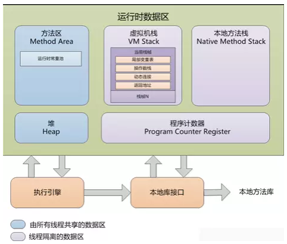

# 1 原理分析

根据 Java 的**内存模型**，会出现内存溢出的有：堆内存、方法区内存、虚拟机栈内存、native 方法区内存。而我们**一般说的 `OOM` 则是堆内存溢出**。

`OOM`：`OutOfMemoryError` 内存溢出错误，是程序设计时未考虑进程在虚拟机中的最大堆内存量，创建了太多的对象，占用的堆内存空间超出进程最大堆内存空间，引发的进程错误。即便是 `GC` 后，还是没能获取到可用的堆内存空间。因此，对于堆内存溢出的根本原因：**应用程序进程内存达到上限**！下面就是一个实际项目中的 `OOM` 场景：

~~~
java.lang.OutOfMemoryError: thread creation failed
        at java.lang.VMThread.create(Native Method)
        at java.lang.Thread.start(Thread.java:1050)
        at java.util.Timer$TimerImpl.<init>(Timer.java:192)
        at java.util.Timer.<init>(Timer.java:367)
        at java.util.Timer.<init>(Timer.java:387)
        at java.util.Timer.<init>(Timer.java:394)
        at com.szIdeaComm.Viper.Cdi.Gpio.Instance.SingleGpioInstance.gpioChange(SingleGpioInstance.java:52)
        at com.szIdeaComm.Viper.Cdi.Gpio.GpioManager$GpioGetQueueThread.run(GpioManager.java:132)
~~~

`/system/build.prop` 系统文件中包含下述进程内存容量：

~~~
dalvik.vm.heapsize=384m
dalvik.vm.heapstartsize=8m
dalvik.vm.heapgrowthlimit=96m
dalvik.vm.heaptargetutilization=0.75
dalvik.vm.heapminfree=2m
dalvik.vm.heapmaxfree=8m
~~~

`dalvik.vm.heapsize` 表明单个进程最大可用堆内存为 `384MB`，而 `dalvik.vm.heapgrowthlimit` 表明单个进程的堆内存限定在 `96MB`，即**单个进程只能使用这么多堆内存**。

~~~java
ActivityManager systemService =
		(ActivityManager) HandlerActivity.this.getApplicationContext().getSystemService(Context.ACTIVITY_SERVICE);
// 应用程序中获取到进程可用堆内存数额
int memory = systemService.getMemoryClass();
LogUtil.d(TAG, "memory:" + memory);
~~~

另外还可以 `adb shell dumpsys meminfo com.zebra.os` 查看指定进程的**内存分配状况**：

~~~
root@android:/data/data # dumpsys meminfo com.zebra.os
Applications Memory Usage (kB):
Uptime: 17591533 Realtime: 17591522

** MEMINFO in pid 6444 [com.zebra.os] **
                         Shared  Private     Heap     Heap     Heap
                   Pss    Dirty    Dirty     Size    Alloc     Free
                ------   ------   ------   ------   ------   ------
       Native        0        0        0     2608     2265      342
       Dalvik     2757     7848     2268     5512     4794      718
       Cursor        0        0        0
       Ashmem        0        0        0
    Other dev        4       24        0
     .so mmap     1649     2204     1024
    .jar mmap        0        0        0
    .apk mmap       88        0        0
    .ttf mmap        3        0        0
    .dex mmap     2254        0       60
   Other mmap       95        8       92
      Unknown     1085      160     1080
        TOTAL     7935    10244     4524     8120     7059     1060

 Objects
               Views:       16         ViewRootImpl:        1
         AppContexts:        4           Activities:        1
              Assets:        2        AssetManagers:        2
       Local Binders:        8        Proxy Binders:       15
    Death Recipients:        0
     OpenSSL Sockets:        0

 SQL
         MEMORY_USED:        0
  PAGECACHE_OVERFLOW:        0          MALLOC_SIZE:        0

~~~

`Naitve Heap Size`：从 `mallinfo usmblks` 获得，代表最大总共分配空间；`Native Heap Alloc`：从`mallinfo uorblks` 获得，总共分配空间；`Native Heap Free`：从 `mallinfo fordblks` 获得，代表总共剩余空间。`Native Heap Size` 约等于 `Native Heap Alloc + Native Heap Free`。

总之，`OOM` 产生的原因：**应用程序需要的堆内存超过了单个进程限制的最大内存量，导致无法获取另外的堆内存空间用于创建对象实例**。

对于应用程序内存达到上限有 2 种情况：

1. 申请内存的速度超出 `GC` 释放内存的速度；
2. 出现**内存泄漏**，`GC` 无法回收泄漏的内存，导致可用内存越来越少；

对于申请内存速度超出 `GC` 释放内存的速度主要有 2 种情况：

1. 往内存中加载超大文件；
2. 循环创建大量对象。

因此，我们可以从 3 个方面对**内存优化**：

* **为应用申请更大的内存**；
* **减少内存的使用**；
  
  * 使用优化后的集合对象，比如 `SparseArray`；
  * 使用微信的 `mmkv` 替代 `SharedPreference`；
  * 对于经常打 Log 的地方使用 `StringBuilder` 来拼装，替代 String；
  * 统一带有缓存的基础库，特别是图片库；
  * 给 `ImageView` 设置合适尺寸的图片，列表页显示缩略图，查看大图显示原图；
  * 线程创建过多：`java.lang.OutOfMemoryError: pthread_create (stack size 16384 bytes) failed: Try again` 因为进程中创建非常多的线程，导致内存溢出。如果仅仅是创建新线程，是需要消耗较多的系统资源的，因此大多数情况下会使用线程池，让线程重复利用；
  * **优化业务架构设计，需要加载则加载，避免将所有数据一起加载，导致撑爆内存**。
* **避免内存泄漏**；

  内存泄漏问题可参考前面的详细分析内容！

# 2 `SparseArray`

散列数组 `SparseArray` 的使用性能高于 `HashMap`，是 `int - Object` 的映射关系。