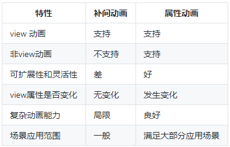
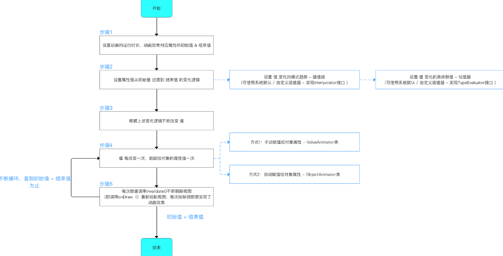

[Android 动画：请收好这一份不见动画完全学习策略](https://www.jianshu.com/p/733532041f46)

针对这一主题，有以下 3 个疑问：

1. 什么是补间动画？什么是属性动画？在一个应用程序中，上述两者的表现分别是什么？
2. 怎么**实现**一个补间动画？怎么**实现**一个属性动画？
3. 上述两者的区别是什么？

`Android` 动画框架包含 2 个大类：

* **视图**动画：**逐帧动画**、**补间动画**，也就是 `View Animation`；
* **属性**动画：属性动画，也就是 `Property Animation`；

上述逐帧动画、补间动画和属性动画都是 `Android` 框架中的动画表现形式，都能够实现动画效果。

# 1 逐帧动画

> 对于一个概念的理解和实践，可以从下述方面进行：原理、作用对象、具体使用、特点（优缺点）、应用场景等。

逐帧动画（`Frame by Frame`），其原理是在“连续的关键帧”中分解动画动作，也就是在时间轴的每帧上逐帧绘制不同的内容，使其连续播放而成动画。

逐帧动画的帧序列内容不一样，不但给制作增加了负担而且最终输出的文件量也很大，其优势也很明显：逐帧动画具有非常大的灵活性，几乎可以表现任何想要表达的内容。

逐帧动画作为视图动画的一种，其作用对象是 `View`。在 `Android` 动画中逐帧动画需要有 `AnimationDrawable` 支持。具体实现可采用 `XML` 和 `Java` 代码实现 2 种方式。

在使用逐帧动画时，应尽可能避免使用尺寸较大的图片，避免 `OOM` 的产生。

# 2 补间动画

**补间动画**，是通过在**两个关键帧**之间补充**渐变的动画效果**来实现的。上述过程确定了开始的视图样式，以及结束的视图样式，中间的整个渐变过程由平台自动计算并补全，以此形成了整个动画效果。

目前 Android 应用框架支持的补间动画效果有：

1. `AlphaAnimation`：透明度渐变；
2. `TranslateAnimation`：位移渐变；
3. `ScaleAnimation`：缩放渐变；
4. `RotationAnimation`：旋转渐变；
5. `AnimationSet`：组合渐变。

上述效果都可在 `android.view.animation` 中找到，同样可以可以使用 `xml` 的方式，动画效果的素材文件通常放在 `res/anim` 目录下。

补间动画的特点：**仅仅只是改变了 View 显示的大小，而没有改变 View 的响应区域**。也就是说，并没有改变动画作用对象 `View` 的属性特征，而仅仅只是一种表现形式是的改变。而且均是基于 `Android` 已有的动画框架。

另外，`Android` 对补间动画还有比较**特殊的使用场景**：

* `Activity` 的切换效果；
* `Fragment` 的切换效果；
* `ViewGroup` 中子 `View` 的出场效果。

# 3 属性动画

属性动画是在 `Android 3.0` 后才提供的一种全新的动画表现形式。**为什么 `Android` 平台提供了属性动画这种方式？**原先 `Android` 平台一直提供的是逐帧动画和补间动画，但这两种方式是有局限的：

（作用对象的局限）补间动画只能够作用在视图 `View` 上，但无法对非 `View` 对象进行动画操作；（作用效果的局限）补间动画仅仅是改变了 `View` 的视觉效果，而不是真正地改变 `View` 的属性，特别是点击响应事件位置等；再者，动画效果单一，只能实现平移、旋转、缩放和透明度的动画效果。

属性动画，通过动画的方式**改变对象的属性**，以 `ObjectAnimator`、`ValueAnimator` 为代表。其工作原理是：在一定时间间隔内，通过不断对值进行改变，并不断将该值赋给对象的属性，从而实现该对象在该属性上的动画效果。

