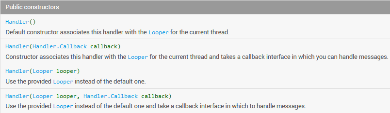
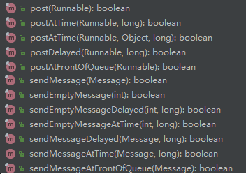
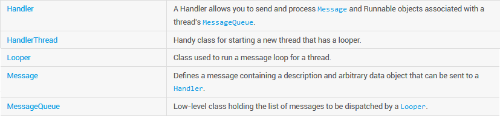
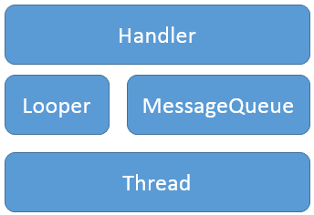

总结各个类的作用：

1. `Looper`：`Message Looper`，用于循环调度`MessageQueue`中的`Message`实例。
2. `MessageQueue`：装载`Message`实例；
3. `Handler`：通过执行`handlerMessage(Message msg)`回调，处理`MessageQueue`中“出队列”的`Message`，并向其中添加`Message`实例；其实例和`Thread`、`MessageQueue`直接相关（三者相互绑定）；`Handler`实例可以和`Looper`交互（交互的作用在于：post系列和send系列方法）；
4. `Thread`：最小的、可执行的程序序列；

# 1 使用Handler

> 首先需要会使用 `Handler` 实例，从分析 `Handler` 的构造方法开始，再去分析在该实例上可被调用的 `public` 方法。

不同平台提供了不同的解决方案以实现**跨线程更新 `UI` 控件**（`UI`控件是非线程安全的），`Android`则引入了`Handler`机制。那么 `Handler` 到底是什么呢？`Handler` 是 `Android` 中引入的一种『让开发者参与处理线程中消息循环』的机制。

每个`Handler`都关联了一个 Thread，每个 Thread 内部都维护了一个消息队列`MessageQueue`，这样`Handler`实际上也就关联了一个消息队列（`Handler <--> Thread <--> MessageQueue`）。 当创建一个`Handler`的时候，该`Handler`就绑定了**当前创建Handler的 Thread**。

> Looper 实例是依附在哪个实例上？

可以通过`Handler`将`Message`和`Runnable`对象发送到该`Handler`所关联线程的`MessageQueue`（消息队列）中，然后该消息队列一直在循环，并使用 Looper 拿出一个`Message`并使用 Handler 或者 `Handler.Callback` 对其进行处理，处理完之后拿出下一个`Message`，继续进行处理，周而复始。 

`Handler`有以下 **2 大用途**：

* 调度 `Message` 和 `Runnable` 的可运行实体，让上述两者在未来的某个时间点运行；
* 调度可执行任务到其他线程中，以实现**线程间通信**。`Handler`是`Thread`的代言人，**是多线程之间通信的桥梁**。通过`Handler`，我们可以在一个线程中控制另一个线程去做某事。 

`Handler`提供了下述构造方法可被调用：



`Handler`中关于 `Message` 和 `Runnable` 的方法有：



1. `post` 版本：在 `Runnable` 被收到后，将会被 `MessageQueue` 入队列并调用执行。
2. `sendMessage` 版本：允许将 `Message` 入队列，同时将会被 `Handler` 的 `handlerMessage()` 处理；

下面来简单使用上述提到的方法：

~~~java
@Override
public void onClick(View v) {
	switch (v.getId()) {
		case R.id.btn_send_runnable: {

			mainHandler.post(new Runnable() {

				@Override
				public void run() {
					LogUtil.trace("Runnable 实例内容");

					Toast.makeText(MainActivity.this, "运行了",
							Toast.LENGTH_SHORT).show();
				}
			});

			break;
		}

		case R.id.btn_send_message: {
			Message msg = mainHandler.obtainMessage();
			msg.what = MSG_WHAT;
			msg.sendToTarget();
            // mainHandler.sendMessage(msg);
			break;
		}
	}
}

private Handler mainHandler = new Handler(){

    @Override
    public void handleMessage(Message msg) {
        super.handleMessage(msg);

        if(MSG_WHAT == msg.what){
            LogUtil.trace("主线程获取 Message");
        }
    }
};

private final int MSG_WHAT = 0xFF;
~~~

`mainHandler.post(runnable)`后，一旦从 `MessageQueue` 中取出这个 `Runnable` 对象后，就会去执行其中的 `run()`；`mainHandler.sendMessage(msg);` 或者是 `msg.sendToTarget();` 都可以让这个 `Message` 实例装载到主线程的 `MessageQueue` 中，等待被取出执行。此时执行的过程是在 `Handler` 中被覆写的 `handleMessage()` 中。

> 在当前线程中创建 Handler 实例时，并不是一定要覆写 `void handleMessage(Message msg)`。因为 `android.os.Handler` 类中并没有相应的语法作为限制。
>
> 但是为了实现 Handler 自定义处理 Message 的流程，必须要覆写上述方法！

另外关于 `sendMessage()` 还可以这样写：

~~~java
Message msg = Message.obtain(mainHandler);
msg.what = MSG_WHAT;
msg.sendToTarget();
~~~

关于 `Message` 实例的获取，推荐使用：`Message.obtain()` 和 `Handler.obtainMessage()` 方式！

比如自定义的`Handler`：

```java
private final class ServiceHandler extends Handler {

	public ServiceHandler(Looper looper) {
		super(looper);
	}

	@Override
	public void handleMessage(Message msg) {
		Bundle arguments = (Bundle) msg.obj;
		String txt = arguments.getString("name");
		LogUtil.trace("Message: " + msg + ", name: " + arguments
				.getString("name") + "; msg"
				+ ".arg2: " + msg.arg2);

		if ((msg.arg2 & Service.START_FLAG_REDELIVERY) == 0) {
			txt = "New cmd #" + msg.arg1 + ": " + txt;
		} else {
			txt = "Re-delivered #" + msg.arg1 + ": " + txt;
		}

		showNotification(txt);

		// Normally we would do some work here...  for our sample, we
		// will just sleep for 5 seconds.
		// 在名为：ServiceStartArguments的工作线程中处理耗时工作
		long endTime = System.currentTimeMillis() + 5 * 1000;
		while (System.currentTimeMillis() < endTime) {
			synchronized (this) {
				try {
					wait(endTime - System.currentTimeMillis());
				} catch (Exception e) {
					LogUtil.trace(e.getMessage());
				}
			}
		}
		hideNotification();

		LogUtil.trace("Done with #" + msg.arg1);
		// TODO 按照startId顺序停止Service，如果参数是最后启动的Service，则返回true
		// 若返回值为true，则表示Service已停止；如果不显式调用，则会一直运行
		boolean isStop = stopSelfResult(msg.arg1);
		LogUtil.trace("msg.arg1:" + msg.arg1 + "; isStop:" + isStop);
	}
}
```

既然 `Handler` 的角色是处理 `Thread` 的 `Message`，自然的，`handleMessage()`是在与之对应的 `Thread` 进行处理的。实例中，如果创建的是`HanderThread`，本身是一个子线程，那么对应的是在该子线程中执行`handleMessage()`。

下面来一个主线程和子线程通信的实例：

~~~java
/**
 * @Description: 创建工作线程，并在其中创建与该线程对一个的 Handler 实体
 * @Author: yaya
 * @CreateDate: 2019/2/24 16:00
 */
class WorkThread extends Thread {

	private Handler workThreadHandler;

	@Override
	public void run() {
		super.run();

		Looper.prepare();

		workThreadHandler = new Handler() {

			@Override
			public void handleMessage(Message msg) {
				super.handleMessage(msg);

				LogUtil.trace("子线程的 Handler 被触发！");

			}
		};

		Looper.loop();
	}

	public Handler getWorkThreadHandler() {
		return workThreadHandler;
	}
}
~~~

主线程中获取到 `WorkThread` 的 `Handler` 实例，并发送消息，此时的 `Message` 会被子线程的 `MessageQueue` 接收到，并处理！

# 2 解析Handler内部设计

`Handler`的内部实现主要涉及到如下几个类: `Thread`、`MessageQueue`和`Looper`。这几类之间的关系可以用如下的图来简单说明： 



上述`API`解析中确定了`Handler`用于**发送和处理**`Thread`的`MessageQueue`中的`Message`和`Runnable`实例的对象。



## 2.1 `MessageQueue`

**作用和用途**：**`android.os.MessageQueue`类**，用于装载`Message`实例，并由`Looper`分发出去处理；`Message`实例并不是直接被添加到`MessageQueue`中的，由和`Looper`相关的`Handler`实例完成（也就是其中的 `postXxx` 和 `sendXxx` 系列方法）。当前线程的`MessageQueue`实例可以通过`Looper.myQueue()`获取。

实际上 `MessageQueue` 中定义的字段，比较熟悉的就是：`Message mMessages;` 表示的是当前链表的头结点！

可将 `MessageQueue` 看作是一个**数据结构**，看作是一种能够实现 Message 排队的**机制**。这种机制提供了 Message 的入队以及出队列的机制。

在 `android.os.MessageQueue` 中比较重要的方法，一个是向 `MessageQueue` 中填入 `Message` 对象的 `enqueueMessage()`：

~~~java
boolean enqueueMessage(Message msg, long when) {
	if (msg.target == null) {
		throw new IllegalArgumentException("Message must have a target.");
	}
	if (msg.isInUse()) {
		throw new IllegalStateException(msg + " This message is already in use.");
	}

	synchronized (this) {
        // 当前 looper 已经退出循环
		if (mQuitting) {
			IllegalStateException e = new IllegalStateException(
					msg.target + " sending message to a Handler on a dead thread");
			Log.w(TAG, e.getMessage(), e);
            // 还回 Message
			msg.recycle();
			return false;
		}

        // 标记当前 Message 已被使用
		msg.markInUse();
        // 向 Message 添加时间戳
		msg.when = when;
        
        // 创建 Message 对象，指向的是当前待处理的 mMessages
		Message p = mMessages;
		boolean needWake;
        // p.when 表示 Message 被处理的时间；越大，表示越滞后
		if (p == null || when == 0 || when < p.when) {
			// New head, wake up the event queue if blocked.
			msg.next = p;
			mMessages = msg;
			needWake = mBlocked;
		} else {
			// Inserted within the middle of the queue.  Usually we don't have to wake
			// up the event queue unless there is a barrier at the head of the queue
			// and the message is the earliest asynchronous message in the queue.
			needWake = mBlocked && p.target == null && msg.isAsynchronous();
			Message prev;
			for (;;) {
                // 通过一个循环把 prev 遍历到最后一个结点，p 是 null 或者是 p.when 滞后于 msg
				prev = p;
				p = p.next;
				if (p == null || when < p.when) {
					break;
				}
				if (needWake && p.isAsynchronous()) {
					needWake = false;
				}
			}
            // 将 msg 插入到 p 之前，以及 prev 之后的位置
			msg.next = p; // invariant: p == prev.next
			prev.next = msg;
		}

		// We can assume mPtr != 0 because mQuitting is false.
		if (needWake) {
			nativeWake(mPtr);
		}
	}
	return true;
}
~~~

另一个重要的方法 `next()` 获取下一个 `Message` 实体对象：

```java
Message next() {
	// Return here if the message loop has already quit and been disposed.
	// This can happen if the application tries to restart a looper after quit
	// which is not supported.
	final long ptr = mPtr;
	if (ptr == 0) {
		return null;
	}

	int pendingIdleHandlerCount = -1; // -1 only during first iteration
	int nextPollTimeoutMillis = 0;
    // 特殊地方：循环，直到取到 msg 对象
	for (;;) {
		if (nextPollTimeoutMillis != 0) {
			Binder.flushPendingCommands();
		}

		nativePollOnce(ptr, nextPollTimeoutMillis);

		synchronized (this) {
			// Try to retrieve the next message.  Return if found.
			final long now = SystemClock.uptimeMillis();
            
            // 设置前置 Message 对象
			Message prevMsg = null;
			Message msg = mMessages;
			if (msg != null && msg.target == null) {
				// 在队列中查找下一个异步消息
				do {
                    // 链表向后移动，prevMsg 中是 msg 的前置结点
					prevMsg = msg;
					msg = msg.next;
				} while (msg != null && !msg.isAsynchronous());
			}
            
			if (msg != null) {
				if (now < msg.when) {
					// 当前遍历到的 msg 还未准备好执行，需要设置一个触发时间
					nextPollTimeoutMillis = (int) Math.min(msg.when - now, Integer.MAX_VALUE);
				} else {
					// Got a message.
					mBlocked = false;
					if (prevMsg != null) {
                        // 跳过 msg 结点
						prevMsg.next = msg.next;
					} else {
						mMessages = msg.next;
					}
                    // msg 结点后续结点置为 null，将 msg 从 MessageQueue 中剥离出来
					msg.next = null;
					if (DEBUG) Log.v(TAG, "Returning message: " + msg);
					msg.markInUse();
                    // 返回获取到的 Message 对象
					return msg;
				}
			} else {
				// No more messages.
				nextPollTimeoutMillis = -1;
			}

			// Process the quit message now that all pending messages have been handled.
			if (mQuitting) {
				dispose();
				return null;
			}

			// If first time idle, then get the number of idlers to run.
			// Idle handles only run if the queue is empty or if the first message
			// in the queue (possibly a barrier) is due to be handled in the future.
			if (pendingIdleHandlerCount < 0
					&& (mMessages == null || now < mMessages.when)) {
				pendingIdleHandlerCount = mIdleHandlers.size();
			}
			if (pendingIdleHandlerCount <= 0) {
				// No idle handlers to run.  Loop and wait some more.
				mBlocked = true;
				continue;
			}

			if (mPendingIdleHandlers == null) {
				mPendingIdleHandlers = new IdleHandler[Math.max(pendingIdleHandlerCount, 4)];
			}
			mPendingIdleHandlers = mIdleHandlers.toArray(mPendingIdleHandlers);
		} // end for synchronized (this)

		// Run the idle handlers.
		// We only ever reach this code block during the first iteration.
		for (int i = 0; i < pendingIdleHandlerCount; i++) {
			final IdleHandler idler = mPendingIdleHandlers[i];
			mPendingIdleHandlers[i] = null; // release the reference to the handler

			boolean keep = false;
			try {
				keep = idler.queueIdle();
			} catch (Throwable t) {
				Log.wtf(TAG, "IdleHandler threw exception", t);
			}

			if (!keep) {
				synchronized (this) {
					mIdleHandlers.remove(idler);
				}
			}
		}

		// Reset the idle handler count to 0 so we do not run them again.
		pendingIdleHandlerCount = 0;

		// While calling an idle handler, a new message could have been delivered
		// so go back and look again for a pending message without waiting.
		nextPollTimeoutMillis = 0;
	} // end for loop
}

```

由此 Handler 就可以向 MessageQueue 中填入 Message 实例，Looper 就可以从中取出 Message 实例！

## 2.2 Looper

**`android.os.Looper`类**用于启动线程的`Message`的**循环处理机制**，`java.lang.Thread`实例默认情况下是不包含`Looper`实例的。如下是创建`Looper`的方法：

```java
class LooperThread extends Thread {
	// Handler实例用于和Looper进行交互，处理其中接收到的Message
	public Handler mHandler;

	public void run() {
	  Looper.prepare();

	  mHandler = new Handler() {
		  public void handleMessage(Message msg) {
			  // process incoming messages here
		  }
	  };

	  Looper.loop();
	}
}
```

为了在线程中创建 `Looper` 对象，首先需要调用 `Looper.prepare()`，以运行整个循环；调用 `Looper.loop()`则用于处理 `Message` 实体。大部分和这个 `Message` 循环机制交互的实体，是 `Handler`！

~~~java
public final class Looper {
    /*
     * API Implementation Note:
     *
     * This class contains the code required to set up and manage an event loop
     * based on MessageQueue.  APIs that affect the state of the queue should be
     * defined on MessageQueue or Handler rather than on Looper itself.  For example,
     * idle handlers and sync barriers are defined on the queue whereas preparing the
     * thread, looping, and quitting are defined on the looper.
     */

    private static final String TAG = "Looper";

    // sThreadLocal.get() will return null unless you've called prepare().
    static final ThreadLocal<Looper> sThreadLocal = new ThreadLocal<Looper>();
    private static Looper sMainLooper;  // guarded by Looper.class

    final MessageQueue mQueue;
    final Thread mThread;
    ...
~~~

`Looper`实例中包含有 2 个元素：`MessageQueue `和 `Thread`，其中`Thread`就是当前运行的线程（当然不一定是主线程，很多时候是子线程）。`Looper sMainLooper` 可以看成是当期线程的 `Looper` 实体。

> 那么对于一个应用进程来说，`Main`线程（`UI`线程）是否有`Looper`实例？主线程默认启动了 `Looper`。

下面分析比较重要 2 个方法：

~~~java
 /** Initialize the current thread as a looper.
  * This gives you a chance to create handlers that then reference
  * this looper, before actually starting the loop. Be sure to call
  * {@link #loop()} after calling this method, and end it by calling
  * {@link #quit()}.
  */
public static void prepare() {
	prepare(true);
}

private static void prepare(boolean quitAllowed) {
	if (sThreadLocal.get() != null) {
		throw new RuntimeException("Only one Looper may be created per thread");
	}
	sThreadLocal.set(new Looper(quitAllowed));
}

private Looper(boolean quitAllowed) {
	mQueue = new MessageQueue(quitAllowed);
    // 获取当前运行的线程
	mThread = Thread.currentThread();
}
~~~

需要值出的是，`Looper`的构造方法是`privated`的，不能调用默认构造方法。如果调用了 `prepare()`，则会将该类中的 `mThread` 成员设置为当前调用的线程，`mQueue`则会创建一个新实例。

~~~java
// sThreadLocal.get() will return null unless you've called prepare().
static final ThreadLocal<Looper> sThreadLocal = new ThreadLocal<Looper>();

/**
 * Initialize the current thread as a looper, marking it as an
 * application's main looper. The main looper for your application
 * is created by the Android environment, so you should never need
 * to call this function yourself.  See also: {@link #prepare()}
 */
public static void prepareMainLooper() {
    // 参数为 false，表示不允许退出 Looper 循环
	prepare(false);
	synchronized (Looper.class) {
		if (sMainLooper != null) {
			throw new IllegalStateException("The main Looper has already been prepared.");
		}
		sMainLooper = myLooper();
	}
}

/**
 * Returns the application's main looper, which lives in the main thread of the application.
 */
public static Looper getMainLooper() {
	synchronized (Looper.class) {
		return sMainLooper;
	}
}

/**
 * Return the Looper object associated with the current thread.  Returns
 * null if the calling thread is not associated with a Looper.
 */
public static @Nullable Looper myLooper() {
	return sThreadLocal.get();
}
~~~

`private static Looper sMainLooper;  // guarded by Looper.class` 是作为进程的 Looper 实例。

再来分析 `loop()`：

~~~java
/**
 * Run the message queue in this thread. Be sure to call
 * {@link #quit()} to end the loop.
 */
public static void loop() {
    // 获取和当前线程相关的 Looper 实例
	final Looper me = myLooper();
	if (me == null) {
		throw new RuntimeException("No Looper; Looper.prepare() wasn't called on this thread.");
	}
    
    // 和 Looper 相关的 MessageQueue 实例
	final MessageQueue queue = me.mQueue;

	// Make sure the identity of this thread is that of the local process,
	// and keep track of what that identity token actually is.
	Binder.clearCallingIdentity();
	final long ident = Binder.clearCallingIdentity();

	for (;;) {
        // might block
		Message msg = queue.next();
		if (msg == null) {
			// No message indicates that the message queue is quitting.
			return;
		}

		// This must be in a local variable, in case a UI event sets the logger
		final Printer logging = me.mLogging;
		if (logging != null) {
			logging.println(">>>>> Dispatching to " + msg.target + " " +
					msg.callback + ": " + msg.what);
		}

		final long slowDispatchThresholdMs = me.mSlowDispatchThresholdMs;

		final long traceTag = me.mTraceTag;
		if (traceTag != 0 && Trace.isTagEnabled(traceTag)) {
			Trace.traceBegin(traceTag, msg.target.getTraceName(msg));
		}
		final long start = (slowDispatchThresholdMs == 0) ? 0 : SystemClock.uptimeMillis();
		final long end;
		try {
            // 重要的调用：msg.target 是 Handler 实例，dispatchMessage() 则会处理该 msg
			msg.target.dispatchMessage(msg);
			end = (slowDispatchThresholdMs == 0) ? 0 : SystemClock.uptimeMillis();
		} finally {
			if (traceTag != 0) {
				Trace.traceEnd(traceTag);
			}
		}
		if (slowDispatchThresholdMs > 0) {
			final long time = end - start;
			if (time > slowDispatchThresholdMs) {
				Slog.w(TAG, "Dispatch took " + time + "ms on "
						+ Thread.currentThread().getName() + ", h=" +
						msg.target + " cb=" + msg.callback + " msg=" + msg.what);
			}
		}

		if (logging != null) {
			logging.println("<<<<< Finished to " + msg.target + " " + msg.callback);
		}

		// Make sure that during the course of dispatching the
		// identity of the thread wasn't corrupted.
		final long newIdent = Binder.clearCallingIdentity();
		if (ident != newIdent) {
			Log.wtf(TAG, "Thread identity changed from 0x"
					+ Long.toHexString(ident) + " to 0x"
					+ Long.toHexString(newIdent) + " while dispatching to "
					+ msg.target.getClass().getName() + " "
					+ msg.callback + " what=" + msg.what);
		}

		msg.recycleUnchecked();
	}
}
~~~

在 `loop()` 中看到了一个大大的死循环！真的是死循环，一直等待获取 `MessageQueue` 中的 `Message` 实例。并在获取到 `Message` 实例后进行处理：`msg.target.dispatchMessage(msg);`

## 2.3 Message

`android.os.Message` 类的主要作用是：封装了可以被 `Handler` 处理的消息实体！

其中定义一些有意思的成员变量：

~~~java
/*package*/ Bundle data;

/*package*/ Handler target;

/*package*/ Runnable callback;

// 维持的是一个 Message 链表结构
/*package*/ Message next;
~~~

而在我们获取一个 `Message` 实体时会用到上述一些实体：

~~~java
/**
 * Same as {@link #obtain()}, but sets the value for the <em>target</em> member on the Message returned.
 * @param h  Handler to assign to the returned Message object's <em>target</em> member.
 * @return A Message object from the global pool.
 */
public static Message obtain(Handler h) {
	Message m = obtain();
	m.target = h;

	return m;
}

/**
 * Return a new Message instance from the global pool. Allows us to
 * avoid allocating new objects in many cases.
 */
public static Message obtain() {
	synchronized (sPoolSync) {
		if (sPool != null) {
			Message m = sPool;
			sPool = m.next;
			m.next = null;
			m.flags = 0; // clear in-use flag
			sPoolSize--;
			return m;
		}
	}
	return new Message();
}
~~~

此时将参数中给定的 `Handler` 实体参数作为 `Message` 将要被处理的目标，即使用参数的 `Handler` 去处理该 `msg`。

在 android.os.Message 的实现中，实际上系统维护了一个 Message 池，在获取 Message 的方式中最佳实践：

1. Message.obtain()；
2. Handler.obtainMessage()

可以从一个循环的 Message 池中获取 Message 实例。

另外在 `Handler` 中实际也调用了上述方法：

~~~java
/**
 * Returns a new {@link android.os.Message Message} from the global message pool. More efficient than
 * creating and allocating new instances. The retrieved message has its handler set to this instance (Message.target == this).
 *  If you don't want that facility, just call Message.obtain() instead.
 */
public final Message obtainMessage()
{
	return Message.obtain(this);
}
~~~

## 2.4 Handler

**`android.os.Handler`类**继承自`java.lang.Object`。`Handler`的已知直接子类有：`AsyncQueryHandler`、`AsyncQueryHandler.WorkerHandler`、`HttpAuthHandler`和`SslErrorHandler`。

**`Hanlder`实例在创建时，默认包含（赋值）了`Looper`和`MessageQueue`成员变量。**从`Thread`线程开始，与之相关的是唯一的`MessageQueue`；而`Handler`实例则是和线程、（线程对应的）`MessageQueue`相关。下述是在 `Handler` 中定义的**成员变量**：

~~~java
final Looper mLooper;
final MessageQueue mQueue;
final Callback mCallback;
final boolean mAsynchronous;
IMessenger mMessenger;
~~~

来看看 `Handler` 的构造方法：

~~~java
/**
 * Default constructor associates this handler with the {@link Looper} for the
 * current thread.
 *
 * If this thread does not have a looper, this handler won't be able to receive messages
 * so an exception is thrown.
 */
public Handler() {
	this(null, false);
}

/**
 * Constructor associates this handler with the {@link Looper} for the
 * current thread and takes a callback interface in which you can handle
 * messages.
 *
 * If this thread does not have a looper, this handler won't be able to receive messages
 * so an exception is thrown.
 *
 * @param callback The callback interface in which to handle messages, or null.
 */
public Handler(Callback callback) {
	this(callback, false);
}

/**
 * Use the provided {@link Looper} instead of the default one.
 *
 * @param looper The looper, must not be null.
 */
public Handler(Looper looper) {
	this(looper, null, false);
}

/**
 * Use the provided {@link Looper} instead of the default one and take a callback
 * interface in which to handle messages.
 *
 * @param looper The looper, must not be null.
 * @param callback The callback interface in which to handle messages, or null.
 */
public Handler(Looper looper, Callback callback) {
	this(looper, callback, false);
}
~~~

上述 4 种不同的构造方法可以归纳如下：

1. `Handler()`：使用当前`Thread`的`Looper`实例创建；
2. `Handler(Handler.Callback callback)`：使用当前`Thread`的`Looper`实例，并包含处理`Message`的回调；
3. `Handler(Looper looper)`：使用其他线程的`Looper`实例；
4. `Handler(Looper looper, Handler.Callback callback)`：使用其他线程的`Looper`实例，并包含处理`Message`的回调；

上述方法在实现时，调用如下的 `@hide` 方法：

~~~java
/**
 * Use the {@link Looper} for the current thread
 * and set whether the handler should be asynchronous.
 *
 * Handlers are synchronous by default unless this constructor is used to make
 * one that is strictly asynchronous.
 *
 * Asynchronous messages represent interrupts or events that do not require global ordering
 * with respect to synchronous messages.  Asynchronous messages are not subject to
 * the synchronization barriers introduced by {@link MessageQueue#enqueueSyncBarrier(long)}.
 *
 * @param async If true, the handler calls {@link Message#setAsynchronous(boolean)} for
 * each {@link Message} that is sent to it or {@link Runnable} that is posted to it.
 *
 * @hide
 */
public Handler(boolean async) {
	this(null, async);
}

/**
 * Use the {@link Looper} for the current thread with the specified callback interface
 * and set whether the handler should be asynchronous.
 *
 * Handlers are synchronous by default unless this constructor is used to make
 * one that is strictly asynchronous.
 *
 * Asynchronous messages represent interrupts or events that do not require global ordering
 * with respect to synchronous messages.  Asynchronous messages are not subject to
 * the synchronization barriers introduced by {@link MessageQueue#enqueueSyncBarrier(long)}.
 *
 * @param callback The callback interface in which to handle messages, or null.
 * @param async If true, the handler calls {@link Message#setAsynchronous(boolean)} for
 * each {@link Message} that is sent to it or {@link Runnable} that is posted to it.
 *
 * @hide
 */
public Handler(Callback callback, boolean async) {
	if (FIND_POTENTIAL_LEAKS) {
		final Class<? extends Handler> klass = getClass();
		if ((klass.isAnonymousClass() || klass.isMemberClass() || klass.isLocalClass()) &&
				(klass.getModifiers() & Modifier.STATIC) == 0) {
			Log.w(TAG, "The following Handler class should be static or leaks might occur: " +
				klass.getCanonicalName());
		}
	}

    // 获取当前线程的 Looper 实例
	mLooper = Looper.myLooper();
	if (mLooper == null) {
		throw new RuntimeException(
			"Can't create handler inside thread that has not called Looper.prepare()");
	}
    // 根据 Looper 实例获取对应的 MessageQueue 实例
	mQueue = mLooper.mQueue;
	mCallback = callback;
	mAsynchronous = async;
}

/**
 * Use the provided {@link Looper} instead of the default one and take a callback
 * interface in which to handle messages.  Also set whether the handler
 * should be asynchronous.
 *
 * Handlers are synchronous by default unless this constructor is used to make
 * one that is strictly asynchronous.
 *
 * Asynchronous messages represent interrupts or events that do not require global ordering
 * with respect to synchronous messages.  Asynchronous messages are not subject to
 * the synchronization barriers introduced by {@link MessageQueue#enqueueSyncBarrier(long)}.
 *
 * @param looper The looper, must not be null.
 * @param callback The callback interface in which to handle messages, or null.
 * @param async If true, the handler calls {@link Message#setAsynchronous(boolean)} for
 * each {@link Message} that is sent to it or {@link Runnable} that is posted to it.
 *
 * @hide
 */
public Handler(Looper looper, Callback callback, boolean async) {
	mLooper = looper;
	mQueue = looper.mQueue;
	mCallback = callback;
	mAsynchronous = async;
}
~~~

`Handler`的作用是发送`Message`、`Runnable`给`MessageQueue`，一旦`Message`出队列时，执行`handleMessage`()方法处理`Message/Runnable`。

下面来看看 `Handler` 的消息调度方法，先来看看 `post` 系列：

~~~java
/**
 * Causes the Runnable r to be added to the message queue.
 * The runnable will be run on the thread to which this handler is 
 * attached. 
 *  
 * @param r The Runnable that will be executed.
 * 
 * @return Returns true if the Runnable was successfully placed in to the 
 *         message queue.  Returns false on failure, usually because the
 *         looper processing the message queue is exiting.
 */
public final boolean post(Runnable r)
{
   return  sendMessageDelayed(getPostMessage(r), 0);
}

/**
 * Causes the Runnable r to be added to the message queue, to be run
 * at a specific time given by <var>uptimeMillis</var>.
 * <b>The time-base is {@link android.os.SystemClock#uptimeMillis}.</b>
 * Time spent in deep sleep will add an additional delay to execution.
 * The runnable will be run on the thread to which this handler is attached.
 *
 * @param r The Runnable that will be executed.
 * @param uptimeMillis The absolute time at which the callback should run,
 *         using the {@link android.os.SystemClock#uptimeMillis} time-base.
 *  
 * @return Returns true if the Runnable was successfully placed in to the 
 *         message queue.  Returns false on failure, usually because the
 *         looper processing the message queue is exiting.  Note that a
 *         result of true does not mean the Runnable will be processed -- if
 *         the looper is quit before the delivery time of the message
 *         occurs then the message will be dropped.
 */
public final boolean postAtTime(Runnable r, long uptimeMillis)
{
	return sendMessageAtTime(getPostMessage(r), uptimeMillis);
}

/**
 * Causes the Runnable r to be added to the message queue, to be run
 * at a specific time given by <var>uptimeMillis</var>.
 * <b>The time-base is {@link android.os.SystemClock#uptimeMillis}.</b>
 * Time spent in deep sleep will add an additional delay to execution.
 * The runnable will be run on the thread to which this handler is attached.
 *
 * @param r The Runnable that will be executed.
 * @param uptimeMillis The absolute time at which the callback should run,
 *         using the {@link android.os.SystemClock#uptimeMillis} time-base.
 * 
 * @return Returns true if the Runnable was successfully placed in to the 
 *         message queue.  Returns false on failure, usually because the
 *         looper processing the message queue is exiting.  Note that a
 *         result of true does not mean the Runnable will be processed -- if
 *         the looper is quit before the delivery time of the message
 *         occurs then the message will be dropped.
 *         
 * @see android.os.SystemClock#uptimeMillis
 */
public final boolean postAtTime(Runnable r, Object token, long uptimeMillis)
{
	return sendMessageAtTime(getPostMessage(r, token), uptimeMillis);
}

/**
 * Causes the Runnable r to be added to the message queue, to be run
 * after the specified amount of time elapses.
 * The runnable will be run on the thread to which this handler
 * is attached.
 * <b>The time-base is {@link android.os.SystemClock#uptimeMillis}.</b>
 * Time spent in deep sleep will add an additional delay to execution.
 *  
 * @param r The Runnable that will be executed.
 * @param delayMillis The delay (in milliseconds) until the Runnable
 *        will be executed.
 *        
 * @return Returns true if the Runnable was successfully placed in to the 
 *         message queue.  Returns false on failure, usually because the
 *         looper processing the message queue is exiting.  Note that a
 *         result of true does not mean the Runnable will be processed --
 *         if the looper is quit before the delivery time of the message
 *         occurs then the message will be dropped.
 */
public final boolean postDelayed(Runnable r, long delayMillis)
{
	return sendMessageDelayed(getPostMessage(r), delayMillis);
}

/**
 * Posts a message to an object that implements Runnable.
 * Causes the Runnable r to executed on the next iteration through the
 * message queue. The runnable will be run on the thread to which this
 * handler is attached.
 * <b>This method is only for use in very special circumstances -- it
 * can easily starve the message queue, cause ordering problems, or have
 * other unexpected side-effects.</b>
 *  
 * @param r The Runnable that will be executed.
 * 
 * @return Returns true if the message was successfully placed in to the 
 *         message queue.  Returns false on failure, usually because the
 *         looper processing the message queue is exiting.
 */
public final boolean postAtFrontOfQueue(Runnable r)
{
	return sendMessageAtFrontOfQueue(getPostMessage(r));
}
~~~

这些方法的共同特定有 2 个：

1. 参数是 `Runnable r` 实例，都调用了 `getPostMessage(r)` 转化成了 `Message` 实例；
2. 都是调用 `sendMessage` 系列方法实现的。

~~~java
private static Message getPostMessage(Runnable r) {
	Message m = Message.obtain();
	m.callback = r;
	return m;
}
~~~

将这个 `Runnable r` 设置为了 `Message` 的成员变量 `callback`。

下面来看看 `sendMessage` 系列方法：

~~~java
/**
 * Pushes a message onto the end of the message queue after all pending messages
 * before the current time. It will be received in {@link #handleMessage},
 * in the thread attached to this handler.
 *  
 * @return Returns true if the message was successfully placed in to the 
 *         message queue.  Returns false on failure, usually because the
 *         looper processing the message queue is exiting.
 */
public final boolean sendMessage(Message msg)
{
	return sendMessageDelayed(msg, 0);
}

/**
 * Sends a Message containing only the what value.
 *  
 * @return Returns true if the message was successfully placed in to the 
 *         message queue.  Returns false on failure, usually because the
 *         looper processing the message queue is exiting.
 */
public final boolean sendEmptyMessage(int what)
{
	return sendEmptyMessageDelayed(what, 0);
}

/**
 * Sends a Message containing only the what value, to be delivered
 * after the specified amount of time elapses.
 * @see #sendMessageDelayed(android.os.Message, long) 
 * 
 * @return Returns true if the message was successfully placed in to the 
 *         message queue.  Returns false on failure, usually because the
 *         looper processing the message queue is exiting.
 */
public final boolean sendEmptyMessageDelayed(int what, long delayMillis) {
	Message msg = Message.obtain();
	msg.what = what;
	return sendMessageDelayed(msg, delayMillis);
}

/**
 * Sends a Message containing only the what value, to be delivered 
 * at a specific time.
 * @see #sendMessageAtTime(android.os.Message, long)
 *  
 * @return Returns true if the message was successfully placed in to the 
 *         message queue.  Returns false on failure, usually because the
 *         looper processing the message queue is exiting.
 */

public final boolean sendEmptyMessageAtTime(int what, long uptimeMillis) {
	Message msg = Message.obtain();
	msg.what = what;
	return sendMessageAtTime(msg, uptimeMillis);
}

/**
 * Enqueue a message into the message queue after all pending messages
 * before (current time + delayMillis). You will receive it in
 * {@link #handleMessage}, in the thread attached to this handler.
 *  
 * @return Returns true if the message was successfully placed in to the 
 *         message queue.  Returns false on failure, usually because the
 *         looper processing the message queue is exiting.  Note that a
 *         result of true does not mean the message will be processed -- if
 *         the looper is quit before the delivery time of the message
 *         occurs then the message will be dropped.
 */
public final boolean sendMessageDelayed(Message msg, long delayMillis)
{
	if (delayMillis < 0) {
		delayMillis = 0;
	}
	return sendMessageAtTime(msg, SystemClock.uptimeMillis() + delayMillis);
}

/**
 * Enqueue a message into the message queue after all pending messages
 * before the absolute time (in milliseconds) <var>uptimeMillis</var>.
 * <b>The time-base is {@link android.os.SystemClock#uptimeMillis}.</b>
 * Time spent in deep sleep will add an additional delay to execution.
 * You will receive it in {@link #handleMessage}, in the thread attached
 * to this handler.
 * 
 * @param uptimeMillis The absolute time at which the message should be
 *         delivered, using the
 *         {@link android.os.SystemClock#uptimeMillis} time-base.
 *         
 * @return Returns true if the message was successfully placed in to the 
 *         message queue.  Returns false on failure, usually because the
 *         looper processing the message queue is exiting.  Note that a
 *         result of true does not mean the message will be processed -- if
 *         the looper is quit before the delivery time of the message
 *         occurs then the message will be dropped.
 */
public boolean sendMessageAtTime(Message msg, long uptimeMillis) {
	MessageQueue queue = mQueue;
	if (queue == null) {
		RuntimeException e = new RuntimeException(
				this + " sendMessageAtTime() called with no mQueue");
		Log.w("Looper", e.getMessage(), e);
		return false;
	}
	return enqueueMessage(queue, msg, uptimeMillis);
}

/**
 * Enqueue a message at the front of the message queue, to be processed on
 * the next iteration of the message loop.  You will receive it in
 * {@link #handleMessage}, in the thread attached to this handler.
 * <b>This method is only for use in very special circumstances -- it
 * can easily starve the message queue, cause ordering problems, or have
 * other unexpected side-effects.</b>
 *  
 * @return Returns true if the message was successfully placed in to the 
 *         message queue.  Returns false on failure, usually because the
 *         looper processing the message queue is exiting.
 */
public final boolean sendMessageAtFrontOfQueue(Message msg) {
	MessageQueue queue = mQueue;
	if (queue == null) {
		RuntimeException e = new RuntimeException(
			this + " sendMessageAtTime() called with no mQueue");
		Log.w("Looper", e.getMessage(), e);
		return false;
	}
	return enqueueMessage(queue, msg, 0);
}
~~~

重点分析其中调用的 `enqueueMessage()`：

~~~java
private boolean enqueueMessage(MessageQueue queue, Message msg, long uptimeMillis) {
	msg.target = this;
	if (mAsynchronous) {
		msg.setAsynchronous(true);
	}
	return queue.enqueueMessage(msg, uptimeMillis);
}
~~~

就是让 `MessageQueue` 装载获取到的 `Message` 实体！

那最后 `Message` 最后是在哪里被处理的呢？

~~~java
/**
 * Handle system messages here.
 */
public void dispatchMessage(Message msg) {
	if (msg.callback != null) {
		handleCallback(msg);
	} else {
		if (mCallback != null) {
			if (mCallback.handleMessage(msg)) {
				return;
			}
		}
		handleMessage(msg);
	}
}
~~~

还记得在 `Looper` 的 `loop()` 中有这么一段调用：`msg.target.dispatchMessage(msg);` 这就是 `Message` 被处理的地方！

* 如果是 `Runnable r` 实例，则会调用 `handleCallback(msg)` ；

  ~~~java
  private static void handleCallback(Message message) {
  	message.callback.run();
  }
  ~~~

  即执行自己的 `Runnable r` 中的 `run()`。

* 如果 `mCallback` 不为空，则会执行这个实例的 `handleMessage(msg)`，否则会执行 `handleMessage(msg)`；

自此 `Handler` 的模型就分析完成了！

# 3 建立关系

消息队列`MessageQueue`，顾名思义，就是存放消息的队列。那队列中存储的消息是什么呢？假设我们在 `UI` 界面上单击了某个按钮，而此时程序又恰好收到了某个广播事件，那我们如何处理这两件事呢？ **因为一个线程在某一时刻只能处理一件事情，不能同时处理多件事情，所以我们不能同时处理按钮的单击事件和广播事件，我们只能挨个对其进行处理，只要挨个处理就要有处理的先后顺序**。 为此**`Android`把`UI`界面上单击按钮的事件封装成了一个`Message`，将其放入到`MessageQueue`里面去**，即将单击按钮事件的`Message`入栈到消息队列中，然后再将广播事件的封装成以`Message`，也将其入栈到消息队列中。也就是说一个`Message`对象表示的是线程需要处理的一件事情，消息队列就是一堆需要处理的`Message`的池。

`MessageQueue`中有两个比较重要的方法，一个是`enqueueMessage`方法，一个是`next`方法。`enqueueMessage`方法用于将一个`Message`放入到消息队列`MessageQueue`中，`next`方法是从消息队列`MessageQueue`中**阻塞式**地取出一个`Message`。在`Android`中，**主线程**的消息队列负责管理着顶级程序对象（`Activity`、`BroadcastReceiver`等）以及由其创建的所有窗口。需要注意的是，消息队列不是`Android`平台特有的，其他的平台框架也会用到消息队列，比如微软的`MFC`框架等。 

消息队列`MessageQueue`只是存储`Message`的地方，真正让消息队列循环起来的是『`Looper`』，这就好比消息队列`MessageQueue`是个水车，那么`Looper`就是让水车转动起来的河水，如果没有河水，那么水车就是个静止的摆设，没有任何用处，`Looper`让`MessageQueue`动了起来，有了活力。 

`Looper`是用来使线程中的消息循环起来的。默认情况下当我们创建一个新的线程的时候，这个线程里面是没有消息队列`MessageQueue`的。为了能够让线程能够绑定一个消息队列，我们需要借助于`Looper`。我们知道线程`Thread`和`Looper`是一对一绑定的，也就是**一个线程中最多只有一个`Looper`对象**，这也就能解释`Looper`的构造函数为什么是`private`的了，我们只能通过工厂方法`Looper.myLooper()`这个静态方法获取当前线程所绑定的`Looper`。 

```java
static final ThreadLocal<Looper> sThreadLocal = new ThreadLocal<Looper>();
```

在`Looper`对象中通过`sThreadLocal`就可以找到其绑定的线程。