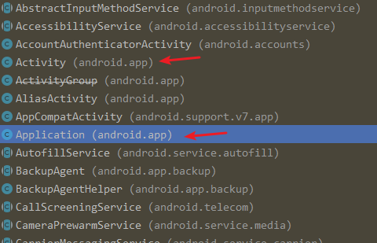

`android.content.Context`：通过 Context 可以访问到关于应用程序环境的上下文（全局信息）。Context 是一个抽象类，**需要 Android 系统提供其具体的实现**。可通过 Context 实例访问到应用程序相关的资源、类，还能够执行应用程序级别的操作，比如启动 Activity、发送广播，接收 Intent 等。

我们熟知的 `android.app.Application` 和 `android.app.Activity` 都是 Context 的实现类。