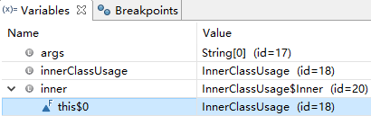
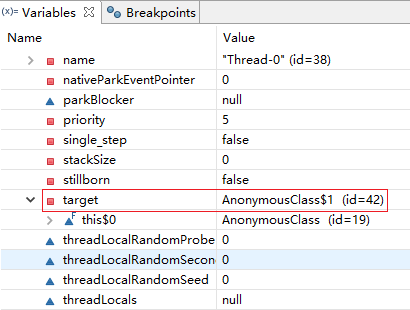
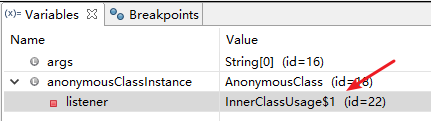

在 Java 中，可以将一个类定义在另一个类或者方法里面，这样定义的类就是内部类。

内部类分为以下 4 种：**成员内部类**、局部内部类、**匿名内部类**和**静态内部类**。

# 1 成员内部类

成员内部类是最普通的内部类，该类被定义在另一个类的内部：

~~~java
package com.zebra.lang;

public class InnerClassUsage {

	public static void main(String[] args) {
		InnerClassUsage innerClassUsage = new InnerClassUsage();
        // 必须通过外部类的实例还创建内部类实例
		Inner inner = innerClassUsage.new Inner();

		inner.say();
	}

	class Inner {
		public void say() {
			System.out.println("I am Inner class Instance!");
		}
	}
}
~~~

`Inner` 类是 `InnerClassUsage` 的内部类。创建的 inner 实例，**默认持有了外部类 InnerClassUsage 对象的引用**。

成员内部类可以无条件访问外部类的所有成员属性和成员方法（包括 private 成员和静态成员）。

成员内部类是依附外部类而存在的，也就是说，如果要创建成员内部类的对象，前提是必须存在一个外部类的对象。

为什么成员内部类可以无条件访问外部类的成员？

反编译 `Inner` 的字节码文件中，包含了一个指向外部类对象的引用！而且该引用指向的是外部类对象。因此，可以在成员内部类中随意访问外部类的成员，从而也间接说明了成员内部类是依赖于外部类的。

# 2 匿名内部类

匿名内部类是我们平时开发过程中写得最多的一种内部类，比如时间监听时使用匿名内部类。

~~~java
package com.zebra.lang;

public class AnonymousClass {

	private CallbackListener listener;

	interface CallbackListener {
		void callback();
	}

	public void setCallbackListener(CallbackListener listener) {
		this.listener = listener;
	}

	public void exeTimeUsableRunnable() {
        // 在主线程中运行
		System.out.println("开始执行方法：" + Thread.currentThread().getName() + "; time: "
				+ System.currentTimeMillis());
		// 匿名内部类 Runnable 实例
		Thread task = new Thread(new Runnable() {

			@Override
			public void run() {
				try {
					Thread.sleep(3000);
				} catch (InterruptedException e) {
					e.printStackTrace();
				}

				listener.callback();
			}
		});
		
		task.start();

	}

}

~~~

在 `exeTimeUsableRunnable()` 中创建了 Thread 实例，并使用了匿名内部类的方式创建了 `Runnable` 实例。

通过上述信息可知，`target` 默认持有了其外部类 `AnonymousClass` 的对象。

~~~java
package com.zebra.lang;

import com.zebra.lang.AnonymousClass.CallbackListener;

public class InnerClassUsage {

	public static void main(String[] args) {
		AnonymousClass anonymousClassInstance = new AnonymousClass();

		// 使用匿名内部类的方式，创建了 CallbackListener 实例
		anonymousClassInstance.setCallbackListener(new CallbackListener() {

			@Override
			public void callback() {
                // 在子线程中运行
				System.out.println(
						Thread.currentThread().getName() + "; time: " + System.currentTimeMillis());
			}
		});

		anonymousClassInstance.exeTimeUsableRunnable();
	}
}
~~~

同样的，`new CallbackListener()` 创建实例时，默认也会持有外部类 `InnerClassUsage` 的对象。

**匿名内部类是唯一一种没有构造器的类**。正因为其没有构造器，所以匿名内部类的使用范围非常有限，大部分匿名内部类用于接口回调。匿名内部类在编译的时候由系统自动起名为 `Outter$1.class`。一般来说，匿名内部类用于继承其他类或是实现接口，并不需要增加额外的方法，只是对继承方法的实现或是重写。

为什么局部内部类和匿名内部类只能访问局部 final 变量？

~~~java
package com.zebra.lang;

import com.zebra.lang.AnonymousClass.CallbackListener;

public class InnerClassUsage {

	public static void main(String[] args) {
		AnonymousClass anonymousClassInstance = new AnonymousClass();

		final int a = 10;

		// 使用匿名内部类的方式，创建了 CallbackListener 实例
		anonymousClassInstance.setCallbackListener(new CallbackListener() {

			@Override
			public void callback() {
				System.out.println(
						Thread.currentThread().getName() + "; time: " + System.currentTimeMillis());
				// 必须是声明为 final 的变量才能访问
				System.out.println("a:" + a);
			}
		});

		anonymousClassInstance.exeTimeUsableRunnable();
	}
}
~~~

上述代码通过匿名内部类的方式创建 `CallbackListener` 实例，实际在编译时，生成了 2 个 `.class` 字节码文件。如果需要在 `callback()` 中访问变量 `a`，考虑一种情况：访问变量 `a` 是在子线程中执行，有可能整个 `main` 都执行完毕了，但是 `callback()` 还没开始执行，此时变量 `a` 的生命周期结束，内存被释放了。事实上，并没有出现上述问题。

Java 采用了复制的方式还解决上述问题。在代码编译期间，声明为 `final` 的变量在该阶段已确定，编译器默认会在匿名内部类的常量池中添加一个内容相等的字面量或直接将相应的字节码嵌入到执行字节码中。这样一来匿名内部类使用的变量是另一个局部变量，只是值和方法中局部变量的值相等。

# 3 静态内部类

静态内部类也是定义在另一个类的里面，只不过类的前面多了一个关键字 static。静态内部类是不需要依赖于外部类的，这点和类的静态成员属性有点类似，并且它不能使用外部类的非 static 成员变量或方法。