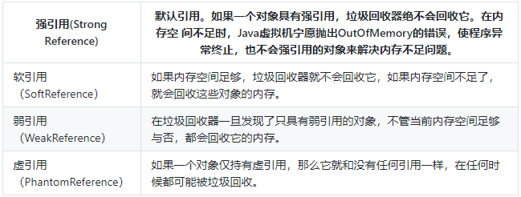
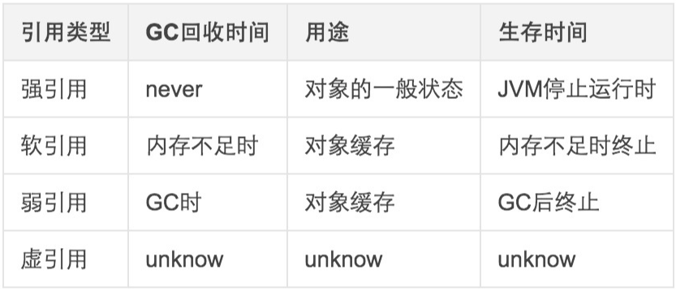
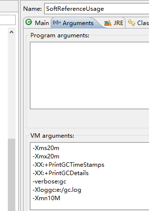
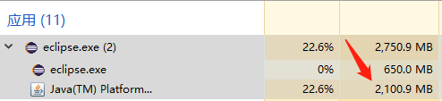

Java 中存在 4 种引用类型：

1. 强引用；
2. 软引用；
3. 弱引用；
4. 虚引用。

总结如下：

另外通过 Eclipse IDE 触发 GC 时，可以通过下述方法查看 GC 日志：

1. -Xms20m --jvm堆的最小值
2. -Xmx20m --jvm堆的最大值
3. -XX:+PrintGCTimeStamps -- 打印出GC的时间信息
4. -XX:+PrintGCDetails  --打印出GC的详细信息
5. -verbose:gc --开启gc日志
6. -Xloggc:e:/gc.log -- gc日志的存放位置
7. -Xmn10M -- 新生代内存区域的大小
8. -XX:SurvivorRatio=8 --新生代内存区域中Eden和Survivor的比例

和通过 `Project --> Run as` 配置 JVM 参数信息：

通过配置 JVM 参数，可以在 `e:\gc.log` 中找到对应的 GC 程序日志。

# 1 强引用

强引用是 Java 中使用最普遍的：Object obj = new Object();

属于强引用的对象，不会被 GC 清理掉。

将对象的引用显式地设置为 null，可帮助 GC 回收此对象。

java.util.ArrayList 的 clear() 中：

~~~java
/**
 * Removes all of the elements from this list.  The list will
 * be empty after this call returns.
 */
public void clear() {
	modCount++;

	// clear to let GC do its work
	for (int i = 0; i < size; i++)
		elementData[i] = null;

	size = 0;
}
~~~

即便是内存不足，Java 虚拟机也不会主动清理具有强引用的对象实例，宁愿抛出 OOM 异常。

# 2 软引用

软引用，用来描述一些还有用但是并非必须的对象，`java.lang.ref.SoftReference` 来表示此种类型对象。如果一个对象与 GC Roots 之间不存在强引用，但是存在软引用，则称这个对象为**软可达（`soft reachable`）对象**。在垃圾回收器没有回收对象内存前，软可达对象就像**强可达对象**一样，可以被程序正常访问和使用，但是需要通过软引用对象间接访问，需要的话也能重新使用强引用将其关联。

对于软引用关联的对象，只有在内存不足的时候，JVM 才会回收该对象。因此，这一点可以很好地解决 OOM 的问题，并且这个特性很适合用来实现缓存：网页、图片缓存等。

~~~java
// 创建强引用与 User 对象管理，现在该对象为强可达状态
User user = new User();
// 根据 User 创建一个软引用实例，使用软引用关联 user 引用的 User 类实例
SoftReference softReference = new SoftReference(user);
// 消除强引用，现在只剩下软引用与其关联，该 User 对象为软可达状态
user = null;
// 重新关联上强引用，相当于是 userStrong 仍然是强引用
User userStrong = (User) softReference.get();
~~~

变量 user 和 userStrong 持有对 User 对象的强引用，而 softReference 持有对该对象的软引用。

对于新创建的 User 实例，有 2 条访问路径：user 的强可达路径，softReference 的软可达路径。总体而言，仍然是强可达的对象。

在 GC 回收对象之前，SoftReference 类所提供的 get 方法会返回 Java 对象的强引用。当内存不足时，`softReference.get()` 会返回 null，但是 softReference 本身是一个强引用。

~~~java
// 获取网页浏览
Browser prev = new Browser();
// 浏览完毕后，设置为软引用
SoftReference softReference = new SoftReference(prev);

// 取消强引用
prev = null;

if(softReference.get() != null){
    // 还没有被GC，直接获取
    rev = (Browser)softReference.get();
}else{
    // 由于内存吃紧，将软引用对象回收
    prev = new Browser();
    // 重新构建
    softReference = new SoftReference(prev);
}
~~~

下面用一个实例说明软引用的使用：

~~~java
package com.zebra.lang;

import java.lang.ref.ReferenceQueue;
import java.lang.ref.SoftReference;
import java.util.ArrayList;
import java.util.List;

public class SoftReferenceUsage {

	static class OOMClass {
		// 400KB
		private int[] oom = new int[1024 * 100];
	}

	public static void main(String[] args) {
		ReferenceQueue<OOMClass> queue = new ReferenceQueue<>();

		List<SoftReference> list = new ArrayList<SoftReference>(5);
		while (true) {
			// 死循环，持续向 List 中添加 OOMClass 实例的弱引用对象
			for (int i = 0; i < 1000; i++) {
				list.add(new SoftReference<OOMClass>(new OOMClass(), queue));
			}
			
			try {
				Thread.sleep(500);
			} catch (InterruptedException e) {
				e.printStackTrace();
			}
		}
	}
}
~~~

内存会持续增加，直到达到触发 GC 的内存阈值：

该内存用来持续在 1700.0MB ~ 2000.0MB 之间波动，意味着触发了多次 GC。下面是 `gc.log` 日志的部分内容：

`0.249: [Full GC (Allocation Failure) [PSYoungGen: 8000K->0K(9216K)] [ParOldGen: 10133K->520K(10240K)] 18133K->520K(19456K), [Metaspace: 2656K->2656K(1056768K)], 0.0038199 secs] [Times: user=0.00 sys=0.00, real=0.00 secs] `

从这条可以看出：在内存不足发生 Full GC 时，回收掉了大部分的软引用指向的对象，释放了大量的内存。

现在考虑这样一个**场景** ，在很多应用中，都会出现大量的默认图片，比如说 QQ 的默认头像，应用内的默认图标等等，这些图片很多地方会用到。

**如果每次都去读取图片，由于读取文件速度较慢，大量重复的读取会导致性能下降**。所以可以考虑将图片缓存起来，需要的时候**直接从内存中读取**。但是，由于图片占用内存空间比较大，缓存的图片过多会占用比较多的内存，就可能比较容易发生 OOM。这时候，软引用就派得上用场了。

注意，SoftReference 对象是用来保存软引用的，但它同时也是一个 Java 对象。所以，当软可及对象被回收之后，虽然这个 SoftReference 对象的 get() 方法返回 null，但 SoftReference 对象本身并不是 null，而此时这个 SoftReference 对象已经不再具有存在的价值，需要一个**适当的清除机制**，避免大量 SoftReference 对象带来的内存泄漏。

ReferenceQueue 就是用来**保存这些需要被清理的引用对象的**。软引用与一个引用队列联合使用，如果软引用的对象被垃圾回收器回收，Java 虚拟机就会把这个软引用加入到与之关联的引用队列中。

软引用缓存 `SoftCache`：

~~~java
package com.zebra.lang;

import java.lang.ref.Reference;
import java.lang.ref.ReferenceQueue;
import java.lang.ref.SoftReference;
import java.util.ArrayList;
import java.util.List;

/**
 * 包含 SoftReference 的缓存类
 * 
 * @author 研发
 *
 * @param <T>
 *            参数化类型
 */
public class SoftCache<T> {
	// 引用队列
	private ReferenceQueue<T> referenceQueue = new ReferenceQueue<>();

	// 保存软引用集合，在引用对象被回收后销毁
	private List<Reference<T>> list = new ArrayList<>();

	// 添加缓存对象
	public synchronized void add(T obj) {
		// 构建软引用
		Reference<T> reference = new SoftReference<T>(obj, referenceQueue);
		// 加入列表中
		list.add(reference);
	}

	// 获取缓存对象
	public synchronized T get(int index) {
		// 先对无效引用进行清理
		clear();
		if (index < 0 || list.size() < index) {
			return null;
		}
		Reference<T> reference = list.get(index);
		return reference == null ? null : reference.get();
	}

	/**
	 * 方法返回 SoftReference 集合的长度（元素个数）
	 * 
	 * @return
	 */
	public int size() {
		return list.size();
	}

	@SuppressWarnings("unchecked")
	private void clear() {
		Reference<T> reference;
		// 循环从 ReferenceQueue 中取出 SoftReference
		while (null != (reference = (Reference<T>) referenceQueue.poll())) {
			// 清除集合中的元素，该元素是 ReferenceQueue 中 SoftReferce 引用对象实例为 null 的部分
			list.remove(reference);
		}
	}
}
~~~

`SoftCache` 用于缓存 SoftReference 的实例，并在 `clear()` 中清理无效的软引用实例（SoftReference 引用的对象实例为 null）。下面看看测试程序：

JVM 虚拟机内存配置：`-verbose:gc -Xms4m -Xmx4m -Xmn2m`

~~~java
package com.zebra.lang;

public class SoftReferenceUsage {

	private static int num = 0;

	static class OOMClass {
		private String name;
		// 400KB
		private int[] oom = new int[1024 * 100];

		public OOMClass(String name) {
			this.name = name;
		}
	}

	public static void main(String[] args) {
		SoftCache<OOMClass> softCache = new SoftCache<>();

		for (int i = 0; i < 10; i++) {
			softCache.add(new OOMClass("OOM Obj-" + ++num));
		}
		// 在不考虑 GC 程序的情况下，创建所有对象实例需要内存为：15.625MB
		System.out.println(softCache.size());

		for (int i = 0; i < softCache.size(); i++) {
			System.out.println("i = " + i);
			// 从 SoftReference 中取到引用的对象实例，触发了 softCache.clear()
			OOMClass obj = softCache.get(i);

			if (null == obj) {
				System.out.println("index:" + i);
			}

			System.out.println(obj == null ? "null" : obj.name);
		}

		// 触发了 softCache.clear() 后，SoftCache 中保存的有效 SoftReference 元素个数
		System.out.println(softCache.size());
	}

}
~~~

缓存40个软引用对象之后，如果一次性全部存储，显然内存大小无法满足，所以在不断创建软引用对象的过程中，不断发生GC来进行垃圾回收，最终只有4个软引用未被清理掉。

> JVM 会优先回收长时间闲置不用的软引用对象，对那些刚刚创建的或刚使用过的软引用对象会尽可能地保留。

下面来看看强引用和软引用的内存比较：

~~~java
package com.zebra.lang;

import java.lang.ref.ReferenceQueue;
import java.lang.ref.SoftReference;
import java.util.ArrayList;
import java.util.List;

public class SoftReferenceUsage {

	private static int num = 0;

	static class OOMClass {
		private String name;
		// 400KB
		private int[] oom = new int[1024 * 100];

		public OOMClass(String name) {
			this.name = name;
		}
	}

	public static void main(String[] args) {
		testStrongReference();
	}

	public static void testStrongReference() {
		ReferenceQueue<OOMClass> referenceQueue = new ReferenceQueue<>();

		List<OOMClass> arrayList = new ArrayList<>();
		for (int i = 0; i < 1000; i++) {
            // 触发了 OOM 异常
			OOMClass oomClass = new OOMClass("obj-" + i);
			arrayList.add(oomClass);
		}
	}

	public static void testSoftReference() {
		ReferenceQueue<OOMClass> referenceQueue = new ReferenceQueue<>();

		List<SoftReference<OOMClass>> arrayList = new ArrayList<>();
		for (int i = 0; i < 1000; i++) {
			OOMClass oomClass = new OOMClass("obj-" + i);

			arrayList.add(new SoftReference<SoftReferenceUsage.OOMClass>(oomClass, referenceQueue));
			oomClass = null;
		}
	}

}
~~~

软引用的测试程序自然不会导致内存溢出，因为在内存不足时，自动触发的 GC 程序会检测当前内存区中的软引用实例，并将其释放掉【`Full GC (Ergonomics)`】。但是强引用的情况：

~~~
Exception in thread "main" java.lang.OutOfMemoryError: Java heap space
	at com.zebra.lang.SoftReferenceUsage$OOMClass.<init>(SoftReferenceUsage.java:15)
	at com.zebra.lang.SoftReferenceUsage.testStrongReference(SoftReferenceUsage.java:31)
	at com.zebra.lang.SoftReferenceUsage.main(SoftReferenceUsage.java:23)
~~~

`OOMClass oomClass = new OOMClass("obj-" + i);` 创建对象实例时发生了 OOM。

# 3 弱引用

WeakReference 和 SoftReference 的区别在于，WeakReference 的生命周期更短暂，在垃圾回收器扫描它管辖的内存区域的过程中，一旦发现弱引用对象马上会被回收；不过因为垃圾回收器的线程优先级很低，所以**不一定马上就发现那些只具有弱引用的对象**。

~~~java
package com.zebra.lang;

import java.lang.ref.Reference;
import java.lang.ref.ReferenceQueue;
import java.lang.ref.WeakReference;
import java.util.LinkedList;

public class WeakReferenceUsage {

	private static ReferenceQueue<String> referenceQueue = new ReferenceQueue<>();

	public static void main(String[] args) {
		int size = 6;

		// 创建一个弱引用的链表实例，用于存储 String 弱引用对象
		LinkedList<WeakReference<String>> linkedList = new LinkedList<WeakReference<String>>();
		for (int i = 0; i < size; i++) {
			// 向链表中连续存入弱引用对象
			linkedList.add(new WeakReference<String>("weak " + i, referenceQueue));
			System.out.println("Just created weak: " + linkedList.getLast().get());
		}

		// 触发 GC，让 GC 程序主动发现具有弱引用关系的对象实例
		System.gc();

		try {
			Thread.currentThread().sleep(3000);
		} catch (InterruptedException e) {
			e.printStackTrace();
		}

		checkQueue();
	}

	public static void checkQueue() {
		Reference<? extends String> ref = null;

		while ((ref = referenceQueue.poll()) != null) {
			// 从 ReferenceQueue 中取出 JVM 已经销毁了其弱引用对象的 WeakReference 实例
			if (ref != null) {
				// ref 不为 null，但是 ref.get() 对象为 null
				System.out.println("In queue: " + ref.get());
			}
		}
	}
}
~~~

`System.gc()` 主动触发垃圾回收程序后，JVM 扫描器“管辖”访问内的对象，一旦发现只有弱引用关系的对象，将销毁其对象，清空内存区域。其结果是：`ref.get()` 返回的对象实例为 null。

# 4 虚引用

一个对象是否有虚引用的存在，都不会对其生存时间构成影响，也**无法通过虚引用来获取对一个对象的真实引用**。唯一的用处：能在对象被 GC 时收到系统通知，Java 中用 PhantomReference 来实现虚引用。

# 5 LruCache

可以利用软引用、弱引用来实现**缓存**；但是在 Android 已经提供了一种缓存策略：`LruCache`；

LRU(Least Recently Used)缓存算法，是**近期最少使用算法**，它的核心思想是**当缓存满的时候，会优先淘汰那些近期最少使用的缓存对象**。采用 LRU 算法的缓存有两种：LrhCache 和 DisLruCache，分别用于实现**内存缓存**和**硬盘缓存**，其核心思想都是 LRU 缓存算法。

~~~java
// 图片缓存
private LruCache<String, Bitmap> mImageCache;

private void initImageCache() {
	// 计算可使用的最大内存，进程能够拿到的最大内存
	int maxMemory = (int) (Runtime.getRuntime().maxMemory() / 1024);
	// 取四分之一作为缓存
	int cacheSize = maxMemory / 4;
	mImageCache = new LruCache<String, Bitmap>(cacheSize) {
        
		@Override
		// 重写sizeOf方法，计算出要缓存的每张图片的大小
		protected int sizeOf(String key, Bitmap bitmap) {
			// Bitmap所占用的内存空间数等于Bitmap的每一行所占用的空间数乘以Bitmap的行数
			return bitmap.getRowBytes() * bitmap.getHeight() / 1024;
		}
	};
}

mImageCache.put(url, bitmap);
Bitmap bitmap = mImageCache.get(url);
~~~

LruCache 是个泛型类，把对象储存在 LinkedHashMap中；LruCache 维护一个缓存对象列表，对象列表的排列方式是按照访问顺序实现的，最近访问的对象放在队尾，没被访问的对象自然被挤到队头，队头的对象最容易被挤掉，被淘汰。