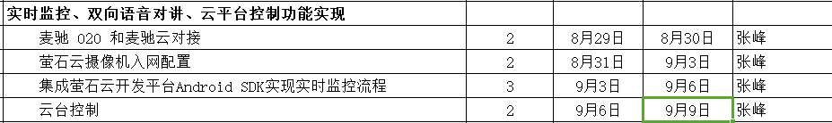

`EZOpenSDK` 来自海康威视——萤石网络，项目目的在于：接入 `EZOpenSDK` 并实现设备绑定、解绑、属性修改和预览直播功能。项目相关的业务逻辑可参考 `EZOpenSDKDemo`。预期目标：

评估的项目开发时间严重不足，时间较多花费在：

* 『大 `B` 账号体系』中和自建后台服务器的接口对接；
* `bug` 修复，涉及到：数据缓存，`UI` 交互。

整个项目实践涉及到如下内容：

1. **网络访问**，异步调用：`EZOpenSDK` 对接使用了『大 `B` 账号体系』，部分网络请求需访问自建的业务服务器。
2. **`UI` 显示和交互**：比如设备列表的显示、`Dialog` 的显示与消失等。`UI` 交互引发业务逻辑的改变，也因此改变了 `UI` 中 `View` 的动作效果。比如：用户按下 `Backspace` 或者 `HOME` 按键。
3. **本地数据存储**，比如内存、文件等。再一个需要区别的是**本地存储**和**内存缓存**。

